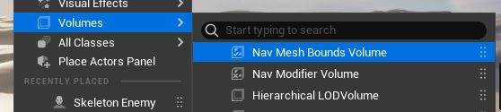
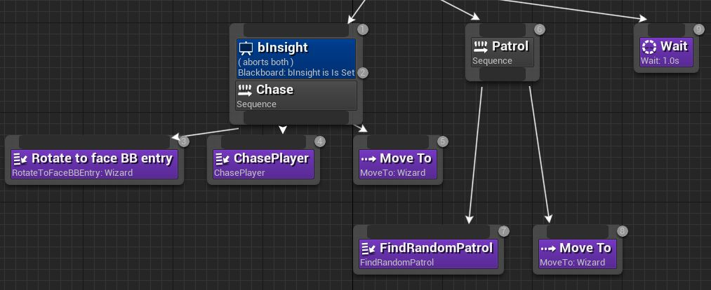
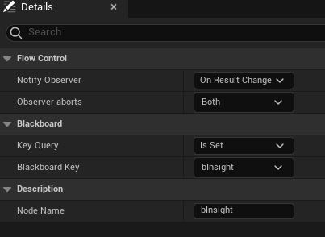

# AI적 생성

이번에는 AI에 의해 조종되는 적을 만들겠다. 적도 플레이어 캐릭터와 같은 방식으로  
클래스 생성 및 애니메이션 처리까지 끝냈다. 흔한 RPG류 처럼 배회하다가 플레이어가  
나타나면 달라 들어서 근접 공격하게 하는 게 목표다.

## AI 컨트롤러/비헤이비어 트리/블랙 보드 관계

- 비헤이비어 트리는(Behavior Tree) : AI를 생성하는 데 사용 할 수 있다. 로직을  
  포함하는 분기를 실행 하고, 어떤 분기를 따를지 판정하고, 블랙 보드에 의존 한다.
- 블랙 보드(Blackboard) : 여러 사용자 정의 키(Key) 를 포함하며 키에는 비에이비어  
  트리가 의사 결정 시에 필요한 정보가 있다.

```c++
//AIController.h
/** blackboard */
UPROPERTY(BlueprintReadOnly, Category = AI, meta = (AllowPrivateAccess = "true"))
TObjectPtr<UBlackboardComponent> Blackboard;

AIMODULE_API virtual void SetPawn(APawn* InPawn) override;

/** Starts executing behavior tree. */
UFUNCTION(BlueprintCallable, Category = "AI")
AIMODULE_API virtual bool RunBehaviorTree(UBehaviorTree* BTAsset);
```

AI컨트롤러 클래스 헤더를 보면 블랙보드 멤버 변수가 있고 BT애셋을 받아서 실행까지 한다.
덕분에 AI컨틀롤러와 나머지 두 클래스 간의 관계가 좀 더 명확해졌다.

## AI 컨틀롤러 생성

  
무심코 지나쳤는데 폰 패널에 AI패널이 따로 있었다.

```c++
//APawn.h
/**
 * Determines when the Pawn creates and is possessed by an AI Controller (on level start, when spawned, etc).
 * Only possible if AIControllerClassRef is set, and ignored if AutoPossessPlayer is enabled.
 * @see AutoPossessPlayer
 */
UPROPERTY(EditAnywhere, Category=Pawn)
EAutoPossessAI AutoPossessAI;

/** Replicated so we can see where remote clients are looking. */
UPROPERTY(replicated)
uint8 RemoteViewPitch;

/** Default class to use when pawn is controlled by AI. */
UPROPERTY(EditAnywhere, BlueprintReadWrite, meta=(DisplayName="AI Controller Class"), Category=Pawn)
TSubclassOf<AController> AIControllerClass;
```

```c++

static ConstructorHelpers::FClassFinder<AEnemyAIController> enemyAIController(TEXT("경로'"));
AIControllerClass = enemyAIController.Class;

//ConstructorHelpers.h
TSubclassOf<T> Class;
FClassFinder(const TCHAR* ClassToFind)
{
	CheckIfIsInConstructor(ClassToFind);
	FString PathName(ClassToFind);
	StripObjectClass(PathName, true);
	Class = ConstructorHelpersInternal::FindOrLoadClass(PathName, T::StaticClass());
	ValidateObject(*Class, PathName, *PathName);
}
```

FClassFinder도 FObjectFinder와 같은 방식이다. 생성자에서 쓰인 건지 확인하고 경로를 받아서  
개체를 생성 한다. 근데 TSubClassOf라는 템플릿 클래스다. 자세한 건 너무 길어져서 별도 문서로
작성했다.

## navMeshBoundsVolume 배치

  
  
navMeshBoundsVolume란 걸 배치해서 AI 캐릭터가 주변을 돌아 다닐 수 있는 navMesh를 생성한다.  
viewPort설정으로 nav영역을 보여주게 하연 녹색으로 영역이 표시된 다. 이 곳으로만 이동이 가능하다.

언리얼 엔진 내비게이션 시스템은 레벨 내 콜리전 지오메트리에서 내비게이션 메시를 생성해서 타일로 분해
한다. 그 타일이 폴리곤으로 분할되어 에이전트가 목적지로 이동할 때 사용하는 그래프를 형성한다. 각
폴리곤에는 에이전트가 전체 비용이 가장 낮은 최적의 경로를 판정하는 데 쓸 비용이 할 당 된다.

## 블랙보드 구성

AI가 알아야하는 요소들은 블랙보드 키를 통해 참조 할 수 있다. AI가 플레이어에 대한 시야 확보 여부와는  
관계 없이 트래킹을 하는 키를 만들고, AI가 쫓지 않을 때 이동 가능한 위치를 확보하겠다.

  
  
  
블랙보드 키(모니터링할 변수)를 추가하고 트래킹할 수 있고, 디테일 패널에서 키에 대한 정보 수정이 가능하다.  
  
시야 확보 bool변수와 이동 가능한 위치 트래킹에 쓸 벡터 변수를 추가하였다. 이제 블랙보드는 끝났고  
비헤이비어 트리를 만들어 보자.

## 비헤이비어 트리

  

애셋을 생성해서 열어보면 블랙보드 애셋이 설정가능하다. 아까만든 BB를 설정해 줬다.  
패널은 그래프, 노드를 정의하는 디테일, 키값 디버깅용 블랙보드로 총 3가지가 있다.
  
자식 노드를 생성하려는 데 컴포짓이란 게 나온다.

- 컴포짓(Composite) : 흐름 제어의 한 형태로, 연결된 자손 분기의 실행 방식을 결정한다.

- 셀렉터(Selector) : 좌->우로 실행. 보통은 하나를 선택하는 데 사용. 실행 가능 한 서브트리를
  찾으면 이동을 멈춘다.
- 시퀀스(Sequence) : 좌->우로 실행. 여러 자손을 순서대로 실행. 실패하기 전까지 계속 실행
- 단순 병렬(Simple Parallel) : 두 개의 연결이 있는데 첫 번쨰는 메인 태스크, 태스크노드에만  
  할당 가능하다. 두 번째는 백그라운드 분기로 메인 태스크가 실행중일 때만 실행된다.

  
노드를 보면 번호가 보이는데 실행 순서이다. 트리는 좌-우, 위-아래 순으로 실행된다.  
자손 분기가 하나라도 실패하면 전체 분기가 중지하여 트리를 다시 거슬러 올라간다.  
  
보라색 노드는 태스크 노드이다. 이 태스크 노드도 커스텀 가능하며 C++로도 가능하다.

- Wait : 모든 자식이 실패 했을 경우 1초 대기하게 한다.
- Rotate to Face BBEntry : 정해진 대상을 향해 회전하도록 한다.
- MoveTo : 정해진 대상을 향해 이동 한다.

  
  
당장은 아무것도 없는 사용자 정의 태스크를 C++로 컴파일 한후 BT구성을 마치었다.

## 태스크 노드

```c++
UBTT_ChasePlayer::UBTT_ChasePlayer()
	:m_chaseSpeed(500.0f)
{
}

EBTNodeResult::Type UBTT_ChasePlayer::ExecuteTask(UBehaviorTreeComponent& ownerComp, uint8* pNodeMemory)
{
	AAIController* pAIController = ownerComp.GetAIOwner();
	if (pAIController == nullptr)
	{
		return EBTNodeResult::Failed;
	}

	ACharacter* pCharacter = pAIController->GetCharacter();
	if (pCharacter == nullptr)
	{
		return EBTNodeResult::Failed;
	}

	UCharacterMovementComponent* pMoveComp= pCharacter->GetCharacterMovement();
	if (pMoveComp == nullptr)
	{
		return EBTNodeResult::Failed;
	}

	pMoveComp->MaxWalkSpeed = m_chaseSpeed;


	return EBTNodeResult::Succeeded;
}

```

BTT_ChasePlayer는 AI컨트롤러-캐릭터-무브먼트를 통해서 몬스터의 속도를 최고속도로 증가 시킨다.  
원본되는 ExecuteTask()는 아무 동작 없이 성공만 반환한다. 잠깐 AI컨트롤러를 어떻게 가져오는 지 보자.

### AI 컨틀롤러는 어떻게 가져오나?

```c++
UCLASS(ClassGroup = AI, meta = (BlueprintSpawnableComponent), MinimalAPI)
class UBehaviorTreeComponent : public UBrainComponent
//...

UCLASS(ClassGroup = AI, BlueprintType, hidecategories = (Sockets, Collision), MinimalAPI)
class UBrainComponent : public UActorComponent, public IAIResourceInterface
{
	GENERATED_UCLASS_BODY()

protected:
	/** blackboard component */
	UPROPERTY(transient)
	TObjectPtr<UBlackboardComponent> BlackboardComp;

	UPROPERTY(transient)
	TObjectPtr<AAIController> AIOwner;
  //...
}
```

트리 컴포넌트는 브레인 컴포넌트를 상속한다. 브레인 컴포넌트를 보면 이 또한 AI컨트롤러를 가진다.

```c++

void UBrainComponent::OnRegister()
{
	Super::OnRegister();

	AIOwner = Cast<AAIController>(GetOwner());
}
//AIController.h
/** Component responsible for behaviors. */
UPROPERTY(BlueprintReadWrite, Category = AI)
TObjectPtr<UBrainComponent> BrainComponent;

void AAIController::PostInitializeComponents()
{
	Super::PostInitializeComponents();

	if (bWantsPlayerState && IsValid(this) && (GetNetMode() != NM_Client))
	{
		InitPlayerState();
	}

	if (BrainComponent == nullptr)
	{
		BrainComponent = FindComponentByClass<UBrainComponent>();
	}
	if (Blackboard == nullptr)
	{
		Blackboard = FindComponentByClass<UBlackboardComponent>();
	}

#if ENABLE_VISUAL_LOG
	for (UActorComponent* Component : GetComponents())
	{
		if (Component)
		{
			REDIRECT_OBJECT_TO_VLOG(Component, this);
		}
	}
#endif // ENABLE_VISUAL_LOG
}
```

AI컨틀로러 클래스에 브레인 컴포넌트가 있고 후초기화(?)시에 FindComponentByClass템플릿으로 호출
하고 있다.

```c++
/* Templatized version of FindComponentByClass that handles casting for you */
template<class T>
T* FindComponentByClass() const
{
	static_assert(TPointerIsConvertibleFromTo<T, const UActorComponent>::Value, "'T' template parameter to FindComponentByClass must be derived from UActorComponent");

	return (T*)FindComponentByClass(T::StaticClass());
}

UActorComponent* AActor::FindComponentByClass(const TSubclassOf<UActorComponent> ComponentClass) const
{
	UActorComponent* FoundComponent = nullptr;

	if (UClass* TargetClass = ComponentClass.Get())
	{
		for (UActorComponent* Component : OwnedComponents)
		{
			if (Component && Component->IsA(TargetClass))
			{
				FoundComponent = Component;
				break;
			}
		}
	}

	return FoundComponent;
}

//Actor.h
AActor::AddOwnedComponent(UActorComponent* Component)
{
  //...
  bool bAlreadyInSet = false;
	OwnedComponents.Add(Component, &bAlreadyInSet);
  //...
}
```

가지고 있는 컴포넌트중에 타겟 클래스랑 일치하면 반환한다. 템플릿은 캐스팅을 용이하게 하기 위함이다.  
AActor::AddOwnedComponent()통해 컴포넌트가 등록되는 데 이 컴포넌트 들 자체는 언제 생성되는 지는 모르겠다.  
다시 태스크노드로 돌아가겠다. 이번에는 순찰 태스크 노드다.

```c++
//추적 태스크 노드랑 앞부분은 같아서 생략.
pMoveComp->MaxWalkSpeed = m_patrolSpeed;
```

속력을 지정한 순찰 속도로 설정한다.

```c++
UWorld* pWorld = GetWorld();
if (pWorld == nullptr)
{
	return EBTNodeResult::Failed;
}
UNavigationSystemV1* pNavSys = UNavigationSystemV1::GetNavigationSystem(pWorld);
if (pNavSys == nullptr)
{
	return EBTNodeResult::Failed;
}

FVector location = pMoveComp->GetActorLocation();
FNavLocation dest;

bool bFound = pNavSys->GetRandomReachablePointInRadius(location, m_patrolRadius, dest);
UBlackboardComponent* pBBComp = pAIController->GetBlackboardComponent();
if (pBBComp == nullptr)
{
	return EBTNodeResult::Failed;
}

pBBComp->SetValueAsVector(FName(TEXT("PatrolLocation")), bFound?dest.Location:location);
```

Actor의 현재 위치로 부터 지정된 반경에 도달 가능한 곳이 있는 지 찾고 있으면 그곳으로, 없다면 잠시 대기하다가  
다시 시도한다. 이번에도 처음 보는 클래스들이 보이니 살펴보자.

UNavigationSystemBase->UNavigationSystemV1순으로 클래스 구조가 되어있는 데 아무런 설명없고 클래스가 매우 무겁다.

```c++
/** Describes a point in navigation data */
struct FNavLocation
{
	/** location relative to path's base */
	FVector Location;

	/** node reference in navigation data */
	NavNodeRef NodeRef;

	FNavLocation() : Location(FVector::ZeroVector), NodeRef(INVALID_NAVNODEREF) {}
	explicit FNavLocation(const FVector& InLocation, NavNodeRef InNodeRef = INVALID_NAVNODEREF)
		: Location(InLocation), NodeRef(InNodeRef) {}

	/** checks if location has associated navigation node ref */
	FORCEINLINE bool HasNodeRef() const { return NodeRef != INVALID_NAVNODEREF; }

	FORCEINLINE operator FVector() const { return Location; }

	bool operator==(const FNavLocation& Other) const
	{
		return Location == Other.Location && NodeRef == Other.NodeRef;
	}
};
```

FNavLocation구조체는 위치 벡터 뿐만 아니라 네비게이션 노드에대한 참조를 담고있다. 네비게이션 시스템 자체는 엄청 깊이있게  
다룰 게 아니라서 일단은 넘어가겠다.

```c#
//Build.cs
PublicDependencyModuleNames.AddRange(new string[] { "Core", "CoreUObject", "Engine", "InputCore", "EnhancedInput", "NavigationSystem" });
```

모듈이 추가되어서 이것도 설정해줘야한다.

## AI 컨틀롤러에 BB, BT설정하기

```c++
AEnemyAIController::AEnemyAIController()
{
	static ConstructorHelpers::FObjectFinder<UBlackboardData>
		enemyBBAsset(TEXT("/Script/AIModule.BlackboardData'/Game/Enemy_BB.Enemy_BB'"));
	if (enemyBBAsset.Succeeded())
	{
		m_pBB = enemyBBAsset.Object;
	}

	static ConstructorHelpers::FObjectFinder<UBehaviorTree>
		enemyBTAsset(TEXT("/Script/AIModule.BehaviorTree'/Game/Enemy_BT.Enemy_BT'"));
	if (enemyBTAsset.Succeeded())
	{
		m_pBT = enemyBTAsset.Object;
	}
}
```

생성자에서 이제까지 만든 애셋들을 FObjectFinder를 통해 등록한다.

```c++
void AEnemyAIController::OnPossess(APawn* pPawn)
{
	Super::OnPossess(pPawn);
	if (m_pBB)
	{
		Blackboard->InitializeBlackboard(*m_pBB);
		if (m_pBT)
		{
		 RunBehaviorTree(m_pBT);
		}
	}
}
```

```c++
void AAIController::OnPossess(APawn* InPawn)
{
	//...
	Super::OnPossess(InPawn);
	//
	// a Pawn controlled by AI _requires_ a GameplayTasksComponent, so if Pawn
	// doesn't have one we need to create it
	//..
}
```

AI컨트롤러에서는 컨트롤러의 버전의 함수를 호출하고, 게임플레이 태스크컴포넌트를 생성한다.

```c++
void AController::OnPossess(APawn* InPawn)
{
	const bool bNewPawn = GetPawn() != InPawn;

	// Unpossess current pawn (if any) when current pawn changes
	if (bNewPawn && GetPawn() != nullptr)
	{
		UnPossess();
	}

	if (InPawn == nullptr)
	{
		return;
	}

	if (InPawn->Controller != nullptr)
	{
		UE_CLOG(InPawn->Controller == this, LogController, Warning, TEXT("Asking %s to possess pawn %s more than once; pawn will be restarted! Should call Unpossess first."), *GetNameSafe(this), *GetNameSafe(InPawn));
		InPawn->Controller->UnPossess();
	}

	InPawn->PossessedBy(this);
	SetPawn(InPawn);

	// update rotation to match possessed pawn's rotation
	SetControlRotation(Pawn->GetActorRotation());

	Pawn->DispatchRestart(false);

}
```

컨트롤러 클래스에서는 기존에 빙의 중이라면 빙의를 해제하고, 빙의/피빙의 사항을 기록하고있다.

```c++
bool UBlackboardComponent::InitializeBlackboard(UBlackboardData& NewAsset)
{
	// if we re-initialize with the same asset then there's no point
	// in reseting, since we'd lose all the accumulated knowledge
	if (&NewAsset == BlackboardAsset)
	{
		return true;
	}

	UAISystem* AISystem = UAISystem::GetCurrentSafe(GetWorld());
	if (AISystem == nullptr)
	{
		return false;
	}

	if (BlackboardAsset && BlackboardAsset->HasSynchronizedKeys())
	{
		AISystem->UnregisterBlackboardComponent(*BlackboardAsset, *this);
		DestroyValues();
	}

	BlackboardAsset = &NewAsset;
	ValueMemory.Reset();
	ValueOffsets.Reset();
	bSynchronizedKeyPopulated = false;

	bool bSuccess = true;

	if (BlackboardAsset->IsValid())
	{
		InitializeParentChain(BlackboardAsset);

		TArray<FBlackboardInitializationData> InitList;
		const int32 NumKeys = BlackboardAsset->GetNumKeys();
		InitList.Reserve(NumKeys);
		ValueOffsets.AddZeroed(NumKeys);

		for (UBlackboardData* It = BlackboardAsset; It; It = It->Parent)
		{
			for (int32 KeyIndex = 0; KeyIndex < It->Keys.Num(); KeyIndex++)
			{
				UBlackboardKeyType* KeyType = It->Keys[KeyIndex].KeyType;
				if (KeyType)
				{
					KeyType->PreInitialize(*this);

					const uint16 KeyMemory = KeyType->GetValueSize() + (KeyType->HasInstance() ? sizeof(FBlackboardInstancedKeyMemory) : 0);
					const int32 OffsetKey = KeyIndex + (int32)It->GetFirstKeyID();
					check(FBlackboard::FKey(OffsetKey) != FBlackboard::InvalidKey);

					InitList.Add(FBlackboardInitializationData(FBlackboard::FKey(OffsetKey), KeyMemory));
				}
			}
		}

		// sort key values by memory size, so they can be packed better
		// it still won't protect against structures, that are internally misaligned (-> uint8, uint32)
		// but since all Engine level keys are good...
		InitList.Sort(FBlackboardInitializationData::FMemorySort());
		uint16 MemoryOffset = 0;
		for (int32 Index = 0; Index < InitList.Num(); Index++)
		{
			ValueOffsets[InitList[Index].KeyID] = MemoryOffset;
			MemoryOffset += InitList[Index].DataSize;
		}

		ValueMemory.AddZeroed(MemoryOffset);

		// initialize memory
		KeyInstances.AddZeroed(InitList.Num());
		for (int32 Index = 0; Index < InitList.Num(); Index++)
		{
			const FBlackboardEntry* KeyData = BlackboardAsset->GetKey(InitList[Index].KeyID);
			if (ensureMsgf(KeyData && KeyData->KeyType, TEXT("Too many elements in blackboard %s (%u)"),*GetNameSafe(BlackboardAsset), InitList.Num()))
			{
				KeyData->KeyType->InitializeKey(*this, InitList[Index].KeyID);
			}
		}

		// naive initial synchronization with one of already instantiated blackboards using the same BB asset
		if (BlackboardAsset->HasSynchronizedKeys())
		{
			PopulateSynchronizedKeys();
		}
	}
	else
	{
		bSuccess = false;
		UE_LOG(LogBlackboard, Error, TEXT("Blackboard asset (%s) has errors and can't be used!"), *GetNameSafe(BlackboardAsset));
	}

	return bSuccess;
}
```

블랙보드 데이터는 등록하려는 애셋이 이미 가진 것과 같은 것인지 확인하고 다르다면 애셋으로 부터 키를 추출하여 배열에 등록한다.

```c++
bool AAIController::RunBehaviorTree(UBehaviorTree* BTAsset)
{
	// @todo: find BrainComponent and see if it's BehaviorTreeComponent
	// Also check if BTAsset requires BlackBoardComponent, and if so
	// check if BB type is accepted by BTAsset.
	// Spawn BehaviorTreeComponent if none present.
	// Spawn BlackBoardComponent if none present, but fail if one is present but is not of compatible class
	if (BTAsset == NULL)
	{
		UE_VLOG(this, LogBehaviorTree, Warning, TEXT("RunBehaviorTree: Unable to run NULL behavior tree"));
		return false;
	}

	bool bSuccess = true;

	// see if need a blackboard component at all
	UBlackboardComponent* BlackboardComp = Blackboard;
	if (BTAsset->BlackboardAsset && (Blackboard == nullptr || Blackboard->IsCompatibleWith(BTAsset->BlackboardAsset) == false))
	{
		bSuccess = UseBlackboard(BTAsset->BlackboardAsset, BlackboardComp);
	}

	if (bSuccess)
	{
		UBehaviorTreeComponent* BTComp = Cast<UBehaviorTreeComponent>(BrainComponent);
		if (BTComp == NULL)
		{
			UE_VLOG(this, LogBehaviorTree, Log, TEXT("RunBehaviorTree: spawning BehaviorTreeComponent.."));

			BTComp = NewObject<UBehaviorTreeComponent>(this, TEXT("BTComponent"));
			BTComp->RegisterComponent();
			REDIRECT_OBJECT_TO_VLOG(BTComp, this);
		}

		// make sure BrainComponent points at the newly created BT component
		BrainComponent = BTComp;

		check(BTComp != NULL);
		BTComp->StartTree(*BTAsset, EBTExecutionMode::Looped);
	}

	return bSuccess;
}
```

BT는 BB가 필요한지, 호환되는 지 확인한 후 ai컨트롤러의 것을 등록한다.  
BTComp 인스턴스가 없다면 생성하여 등록한다. 준비가 되면 BT를 실행한다.

## AI퍼셉션

AI컨트롤러에 퍼셉션(인지)컴포넌트를 추가해야한다. 잊지말자, bInSight라는 변수가 있다.  
플레이어 생성시에 스켈레탈 컴포넌트를 추가한 방식과 같은 방식으로 추가한다. 그리고  
필요하다면 변수를 설정한다. DetectionAffiliation은 소속 감지를 뜻하는데 현재는 소속이  
없으니 중립탐지로 설정했다.

```c++
m_pSightConfig = CreateDefaultSubobject<UAISenseConfig_Sight>(TEXT("AISightConfig"));
check(m_pSightConfig != nullptr);

m_pSightConfig->SightRadius = 3000.0f;
m_pSightConfig->LoseSightRadius = 3500.0f;
m_pSightConfig->PeripheralVisionAngleDegrees = 90.0f;

m_pSightConfig->DetectionByAffiliation.bDetectEnemies = true;
m_pSightConfig->DetectionByAffiliation.bDetectNeutrals = true;
m_pSightConfig->DetectionByAffiliation.bDetectFriendlies = false;

```

갑자기 델리게이트란게 나오는 데 내용이 길어져서 다른 md파일로 뺐다. 당장은 콜백함수 정도로  
알아 두자. 이 이벤트는 퍼셉션 시스템이 업데이트를 수신할 때 실행되어 업데이트 신호를 보낸 액터와  
추가 정보를 얻을 수 있는 AI 자극(AI Stimulus) 구조체를 반환한다.

```c++
PerceptionComponent->OnTargetPerceptionUpdated.AddDynamic(this, OnTargetInSight);
PerceptionComponent->ConfigureSense(*m_pSightConfig);
```

```c++
void AEnemyAIController::OnTargetInSight(AActor* pActor, FAIStimulus const Stimulus)
{
	bool bWizard = pActor->ActorHasTag(TEXT("Wizard"));
	bool bSensed = Stimulus.WasSuccessfullySensed();

	if (bWizard && bSensed)
	{
		m_hTimer.Invalidate();
		Blackboard->SetValueAsBool(FName(TEXT("bInSight")), true);
		Blackboard->SetValueAsObject(FName(TEXT("Wizard")), pActor);
	}
	else
	{
		UWorld* pWolrd = pActor->GetWorld();
		FTimerManager& timerManager =  pWolrd->GetTimerManager();
		timerManager.SetTimer(m_hTimer, this, StartEnemyTimer, 4.0f);
	}
}

void AEnemyAIController::StartEnemyTimer()
{
	Blackboard->SetValueAsBool(FName(TEXT("bInSight")), false);
	Blackboard->SetValueAsObject(FName(TEXT("Wizard")), nullptr);
}
//Wizard.cpp
Tags.Add(FName(TEXT("Wizard")));
```

타깃이 시야에 들어오면 Wizard인지, 제대로 감지했는지 확인하여 그렇다면 타이머를 초기화하고 BB데이터를
갱신한다 그렇지 않다면 BB데이터를 무효값으로 설정해둔다. Wizard개체에 태그를 넣는 걸 잊지 말자.
안그러면 저 분기문을 절대 통과 못 한다.

멤버변수로 컴포넌트 포인터가 있다고해서 무조건 자동 생성되는 건 아닌가보다. 계속 크래시가 났었다.

```c++
AAIController::AAIController(const FObjectInitializer& ObjectInitializer)
	: Super(ObjectInitializer)
{
	bSetControlRotationFromPawnOrientation = true;
	PathFollowingComponent = CreateOptionalDefaultSubobject<UPathFollowingComponent>(TEXT("PathFollowingComponent"));
	if (PathFollowingComponent)
	{
		PathFollowingComponent->OnRequestFinished.AddUObject(this, &AAIController::OnMoveCompleted);
	}

	ActionsComp_DEPRECATED = CreateOptionalDefaultSubobject<UDEPRECATED_PawnActionsComponent>(TEXT("ActionsComp"));
	//...
}
void AAIController::PostInitializeComponents()
{
	Super::PostInitializeComponents();

	if (bWantsPlayerState && IsValid(this) && (GetNetMode() != NM_Client))
	{
		InitPlayerState();
	}

	if (BrainComponent == nullptr)
	{
		BrainComponent = FindComponentByClass<UBrainComponent>();
	}
	if (Blackboard == nullptr)
	{
		Blackboard = FindComponentByClass<UBlackboardComponent>();
	}
	//...
}

void AAIController::PostRegisterAllComponents()
{
	Super::PostRegisterAllComponents();

	// cache PerceptionComponent if not already set
	// note that it's possible for an AI to not have a perception component at all
	if (!IsValid(PerceptionComponent))
	{
		PerceptionComponent = FindComponentByClass<UAIPerceptionComponent>();
	}
}
//BlackboardComponent.cpp
void UBlackboardComponent::InitializeComponent()
{
	Super::InitializeComponent();

	// cache blackboard component if owner has one
	// note that it's a valid scenario for this component to not have an owner at all (at least in terms of unittesting)
	AActor* Owner = GetOwner();
	if (Owner)
	{
		BrainComp = GetOwner()->FindComponentByClass<UBrainComponent>();
		if (BrainComp)
		{
			BrainComp->CacheBlackboardComponent(this);
		}
	}
	//..
}

//Actor.cpp
void AActor::AddOwnedComponent(UActorComponent* Component)
{
	check(Component->GetOwner() == this);

	// Note: we do not mark dirty here because this can be called when in editor when modifying transient components
	// if a component is added during this time it should not dirty.  Higher level code in the editor should always dirty the package anyway
	const bool bMarkDirty = false;
	Modify(bMarkDirty);

	bool bAlreadyInSet = false;
	OwnedComponents.Add(Component, &bAlreadyInSet);
}
```

BT와, BB는 FindComponentByClass를 호출하긴하는 데 해당 컴포넌트 포인터가 없다면 nullptr를  
반환하는 함수다. 액터컴포넌트의 Init()함수조차 오너 개체를 가져와 이 함수를 호출하는 게 다이다.

## 데코레이터

비헤이비어 트리에서 노드를 우클릭하면 서브 노드를 추가할 수 있다. 우리는 데코레이터를 이용할 것이다.

- 데코레이터(Decorator) : 조건식이라고도 한다. 이 노드는 다른 노드에 어태치되어 트리의 분기나
  단일 노드의 실행 여부를 결정한다.
- 서비스(Service) : 태스크나 컴포짓 노드에 어태치하여 자신의 분기가 실행되는 동안 정의된 주기 만큼
  실행된다.

  


### 기타 변경 사항

#### 참조

- [유튜브 재생목록- Learn all About AI in Unreal Engine 5](https://www.youtube.com/playlist?list=PL4G2bSPE_8uklDwraUCMKHRk2ZiW29R6e)
- [공식 문서 : AAIController](https://dev.epicgames.com/documentation/en-us/unreal-engine/API/Runtime/AIModule/AAIController)
- [공식 문서 : 비헤이비어 트리 퀵 스타트 가이드](https://dev.epicgames.com/documentation/ko-kr/unreal-engine/behavior-tree-in-unreal-engine---quick-start-guide?application_version=5.3)
- [공식 문서 : TSubclassOf](https://dev.epicgames.com/documentation/ko-kr/unreal-engine/typed-object-pointer-properties-in-unreal-engine?application_version=5.3)
- [공식 문서 : 내비게이션 시스템](https://dev.epicgames.com/documentation/ko-kr/unreal-engine/navigation-system-in-unreal-engine?application_version=5.3)
- [공식 문서 : UBTTaskNode](https://dev.epicgames.com/documentation/en-us/unreal-engine/API/Runtime/AIModule/BehaviorTree/UBTTaskNode?application_version=5.3)
- [공식 문서 : UNavigationSystemV1](https://dev.epicgames.com/documentation/en-us/unreal-engine/API/Runtime/NavigationSystem/UNavigationSystemV1?application_version=5.3)
- [공식 문서 : AIPerception](https://dev.epicgames.com/documentation/en-us/unreal-engine/ai-perception-in-unreal-engine?application_version=5.2)
