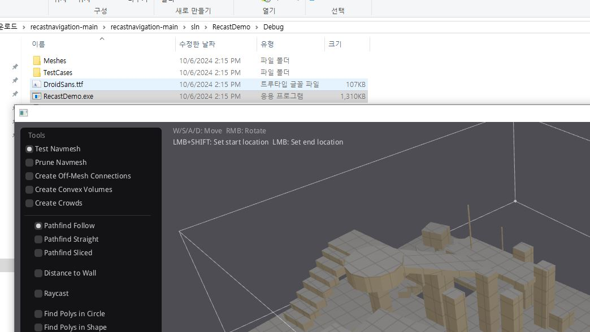

# AI 및 전투 패킷

잠시 없앴던 적도 다시 복구해야한다. 근데 서버에서 BT와 충돌도 구현해야한다.  
쉽지 않다.

## AI 패킷

스폰, 디스폰(사망), 공격, 이동 크게 4개로 잡았다.

## AI 스폰

스폰은 유저가 처음 입장할 떄 한 번 해주고 죽을 떄(디스폰)마다. 일정 주기로 다시 스폰하기로 했다.
5마리를 서버에서 관리한다. PlayerInfo와 마찬가지로 서버에 EnemyInfo와 그 매니저를 만들었다.  
그전에 패킷을 먼저 추가 했다.

Enemy는 Player와 같다. 다만 id는 배열 색인을 담고, moveState는 점프가 제외 된다. 추적할때만
Sprint가 된다.

```c++
message Enemy
{
	required int32 id=1;
	required int32 hp=2;
	required Coordiante coord=3;
	required Rotation rot=4;
	required MoveState moveState=5;
}
```

AI 동작은 순수히 서버에서 판단하므로 클라는 그저 서버에서 받아오기만 한다.

```c++
message S_EnemySpawn
{
	repeated Enemy enemy=1;
}

message S_EnemyDespawn
{
	required int32 id=1;
}
```

플레이어가 적을 공격하여 정말로 충돌이 발생하면 공격 결과를 실제 Enemy값으로 전송한다.
만약 허공에 공격하거나 그냥 다른 플레이어에 유효타가 발생한 경우는 Enemy의 아이디 값에  
 -1과 같은 유효하지 않은 값을 넣어서 구분짓는다.

```c++
message C_Attack
{
	required int32 id=1;
}

message S_Attack
{
	required Enemy enemy=1;
}
```

서버가 켜지면 매니저 클래스가 미리 enemyInfo 배열을 채운다.

```c++
EnemyManager::EnemyManager()
	:m_enemyLock(4)
{
	for (int i = 0; i < sizeof(m_enemies)/sizeof(void*); ++i)
	{
		shared_ptr<EnemyInfo> pEnemyInfo = MakeShared<EnemyInfo>(i);
        m_enemies[i] = pEnemyInfo;
	}
}

```

플레이어가 플레이어 스폰 패킷을 보내면 응답으로 S_Spawn과 함께 적 스폰 패킷도 보내준다.  
패킷을 채우는 건 정보를 들고 있는 매니저에서 한다.

```c++
void EnemyManager::MakeEnemySpawnPacket(S_EnemySpawn& pkt)
{
	for (int i = 0; i < sizeof(m_enemies)/sizeof(void*); ++i)
	{
		Enemy* pCurEnemy = pkt.add_enemy();
		*pCurEnemy = *(m_enemies[i]->GetEnemy());
	}

}

PacketHandler::ProcessC_Spawn(PacketHeader* pHeader)
{
	S_EnemySpawn pkt;
	g_pEnemyManager->MakeEnemySpawnPacket(pkt);
	int packetSize = sizeof(PacketHeader) + pkt.ByteSizeLong();
	shared_ptr<SendBuffer> pSendBuffer = make_shared<SendBuffer>(packetSize);
	PacketHandler::SerializeS_EnemySpawn(pkt, pSendBuffer->GetBuffer());
	shared_ptr<Session> pSession = g_pSessionManager->GetSessionById(c_spawn.id());
	pSession->RequestSend(pSendBuffer);
}
```

클라쪽에서는 받아서 게임스테이트의 에너미 추가 함수를 불러준다. 에너미의 색인 위치에 Spawn  
함수 결과를 대입한다.

```c++

void CPacketHandler::ProcessS_EnemySpawn(CPacketHeader* pHeader)
{
	S_EnemySpawn pkt = ParseS_EnemySpawn(reinterpret_cast<char*>(pHeader));
	UWorld* pCurWorld = m_pGameInstance->GetWorld();
	ACastleDefenseGameState* pGameState = pCurWorld->GetGameState<ACastleDefenseGameState>();

	for (int i = 0; i < pkt.enemy_size(); ++i)
	{
		Enemy curEnemy= pkt.enemy(i);
		pGameState->AddEnemy(&curEnemy);
	}
}

void ACastleDefenseGameState::AddEnemy(Enemy* pEnemyInfo)
{
	int32 idx = pEnemyInfo->id();

	Coordiante coord = pEnemyInfo->coord();
	FVector location = FVector(coord.x(), coord.y(), coord.z());
	FRotator rotation = FRotator::ZeroRotator;

	UWorld* pCurWorld = GetWorld();
	m_enemies[idx] = pCurWorld->SpawnActor<ASkeletonEnemy>(location,rotation);
}
```


## 공격

게임스테이트에서 포인터와 색인을 연결 시켜주는 TMap을 만든다. 만약 플레이어 클라이언트 단의 충돌
판정이 유효하다면 적 색인을 패킷으로 담아 전송한다.

```c++
int ACastleDefenseGameState::GetEnemyIndexByPtr(ASkeletonEnemy* pEnemy)
{
	return m_enemyPtrToIdx.Find(pEnemy) == nullptr ?
		-1 : m_enemyPtrToIdx[pEnemy];
}


void AWizard::CheckPlayerAttack()
{
	UWorld* pWorld = GetWorld();
	if (pWorld)
	{
		FHitResult hitResult;
		FVector start = GetActorLocation();
		FVector end = start + GetActorForwardVector() * 500.f;
		FCollisionObjectQueryParams queryObjParams;
		queryObjParams.AddObjectTypesToQuery(ECollisionChannel::ECC_Pawn);
		FCollisionQueryParams queryParams;
		queryParams.AddIgnoredActor(this);
		pWorld->LineTraceSingleByObjectType(hitResult, start, end, queryObjParams, queryParams);
		DrawDebugLine(pWorld, start, end, FColor::Red, false, 5.0f);
		if (hitResult.bBlockingHit)
		{
			AActor* pOther = hitResult.GetActor();
			if (pOther&&pOther->IsA(ASkeletonEnemy::StaticClass()))
			{
				UE_LOG(LogTemp, Display, TEXT("EnemyGotHit"));
				ASkeletonEnemy* pEnemy = Cast<ASkeletonEnemy>(pOther);

				UWorld* pCurWorld = GetWorld();
				ACastleDefenseGameState* pGameState = pCurWorld->GetGameState<ACastleDefenseGameState>();
				int idx = pGameState->GetEnemyIndexByPtr(pEnemy);

				UCastleDefenseGameInstance* pGameInstance = pCurWorld->GetGameInstance<UCastleDefenseGameInstance>();
				TSharedPtr<ClientSession> pSession = pGameInstance->GetSession();
				pSession->SendC_Attack(idx);
			}
		}
	}
}
```

서버에서는 메모리에 있는 적 개체의 hp를 감소하고 S_Attack으로 해당 적 개체를 직렬화해서  
보낸다.

```c++
void PacketHandler::ProcessC_Attack(PacketHeader* pHeader)
{
	C_Attack pkt = ParseC_Attack((char*)pHeader);
	g_pEnemyManager->DecreaseHp(pkt.id());

	S_Attack response;
	shared_ptr<EnemyInfo> pEnemyInfo = g_pEnemyManager->GetPlayerById(pkt.id());
	response.set_allocated_enemy(pEnemyInfo->GetEnemy());

	int packetSize = sizeof(PacketHeader) + pkt.ByteSizeLong();
	shared_ptr<SendBuffer> pSendBuffer = make_shared<SendBuffer>(packetSize);
	SerializeS_Attack(response, pSendBuffer->GetBuffer());
	g_pSessionManager->Brodcast(pSendBuffer, nullptr);

	response.set_allocated_enemy(pEnemyInfo->GetEnemy());
}

```

이 패킷을 받은 클라이언트는 게임스테이트에서 idx값을 통해서 적 체력 감소 함수를 호출한다. 지금 보니 id값만 보내고,  
Despawn패킷은 필요 없다. 변경 해야겠다.

```c++
void ACastleDefenseGameState::UpdateEnemyHp(Enemy* pEnemy)
{
	int idx = pEnemy->id();
	m_enemies[idx]->DecreaseHp();
}
```

~~적 리스폰은 단순 무식하게 클라에서 보내고 중복 여부만 처리하게 했다.~~

## 서버 충돌 판정

적 공격 여부를 클라에서 판단하는 건 부정행위의 위험이있다. 또한 스폰시에 서버단에서 충돌을 감안 못해서  
 서버와 클라간의 정보가 어긋날수 있다. 그렇다고 클라에 충돌처리를 맡겨 버리면 클라마다 다르게 나올수
있어서 서버에서 꼭 처리해 줘야한다.

XYZ 각각 플레이어는 230/90/200, 적은 120/45/175 이다. 애니메이션 파일이던 메시 파일이던 에디터에서  
뷰포트에 ApproxSize로 대략적인 크기를 알수있다. 이를 위치 값에 더해서 계산할 것이다.

근데 이것도 정책이 매우 갈린다. 본인은 매우 개괄적으로 할 생각이다. 당장 급한건 BT라서 이건 시간이 나면 추가 하겠다.

## 공격 판정

클라이언트 측에서 라인 트레이스 방식을 썼는 데 서버는 만약 정해진 거리를 넘어서면 그냥 패킷을 씹으려고 한다.
원래는 강제 종료 시키도록 해야하는 게 맞다고 한다. 정석이라면 AABB에 행렬에, 직선과 평면이 교차하는 지까지  
해줘야하지만 그냥 현재 플레이어와의 거리가 510, 500이니까 약간의 오차를 감안해서, 이 넘어가면 무시할 것이다.

```c++
FVector start = GetActorLocation();
FVector end = start + GetActorForwardVector() * 500.f;
```

클라이언트 측에서 공격자와 피격자의 id 값을 패킷에 넣도록 다시 변경했다.

```c++
message C_Attack
{
	required int32 Attacker=1;
	required int32 Target=2;
}
```

간단히 유클리드 공식만 썼다.

```c++
void PacketHandler::ProcessC_Attack(PacketHeader* pHeader)
{
	C_Attack pkt = ParseC_Attack((char*)pHeader);

	//서버 판정
	shared_ptr<PlayerInfo> pPlayerInfo = g_pPlayerManager->GetPlayerById(pkt.attacker());
	Coordiante* pPlayerCoord = pPlayerInfo->GetCoord();
	shared_ptr<EnemyInfo> pEnemyInfo = g_pEnemyManager->GetEnemyById(pkt.target());
	Coordiante* pEnemyCoord = pEnemyInfo->GetCoord();
	int xLen = abs(pEnemyCoord->x() - pPlayerCoord->x());
	int yLen = abs(pEnemyCoord->y() - pPlayerCoord->y());

	bool bInRange = sqrt(xLen * xLen + yLen * yLen)<510;
	if (bInRange)
	{
		g_pEnemyManager->DecreaseHp(pkt.target());
		cout << pkt.attacker() << " attack " << pkt.target() << endl;
		S_Attack response;

		response.set_allocated_enemy(pEnemyInfo->GetEnemy());

		int packetSize = sizeof(PacketHeader) + response.ByteSizeLong();
		shared_ptr<SendBuffer> pSendBuffer = make_shared<SendBuffer>(packetSize);
		SerializeS_Attack(response, pSendBuffer->GetBuffer());
		g_pSessionManager->Brodcast(pSendBuffer, nullptr);

		response.release_enemy();
	}

}
```

다른 플레이어의 공격 모션이 보이지 않는 데 player패킷에 공격여부를 bool로 처리하게했다. S_Attack에 넣어 버리려 했는 데 이러면 공격 모션 종료가 문제다.
move 갱신시에 같이 처리하도록 했다. actionState도 넣을 까 했는 데 공격 말고 없다.

```c++
void ACastleDefenseGameState::UpdatePlayerPos(Player* pPlayer)
{
	AWizard* pCurPlayer = m_idToPlayer[pPlayer->id()];
	pCurPlayer->SetNewDest(pPlayer);

	if (pPlayer->battack())
	{
		pCurPlayer->StartAttack();
	}
	else
	{
		pCurPlayer->StopAttack();
	}
}
```


적이 죽으면 리스폰 할 지를 결정 못해서 당장은 서버 메모리에 그냥 좀비 상태로 남아있다.

## 서버에서의 적 경로 계산

가만 생각해보니 네비게이션 메시가 있었다. 경로 찾기야 어떻게 되었든 에디터 현재 레벨의 네비게이션 메시가 필요했다. 이를 서버에서 사용 하도록 해야한다.  
현재 언리얼 엔진 공식 커뮤니티에서 보이는 글들이 죄다 ExportNavigationData라는 함수를 썼는 데 정작 맵 obj파일 자체가 파싱된 된다는 이야기 였다.

```c++
FWorldContext Context = GEngine->GetWorldContexts().Last();
	UWorld *World = Context.World();

	UNavigationSystem* NavSys = World->GetNavigationSystem();
	NavSys->GetMainNavData(FNavigationSystem::ECreateIfEmpty::Create)->GetGenerator()->ExportNavigationData(FString(TEXT("Test.obj")));
```

결국 NavigationSystem으로부터 메시를 직접 파싱 해야한다고 한다. 네비게이션시스템과 그 관련 클래스에 관한 내용은 다른 문서파일으로 작성했다.
분석하고 나니 어차피 엔진에서도 Recast&Detour라는 라이브러리를 쓰는 데 나도 이걸 서버에 가져와서 쓰려고한다. 네비게이셔 메시 파싱

### RecastNavigation 추출

이것도 CMAKE를 써야한다. 어차피 해당 repo에 설치 방법이 나와 있지만 유의사항으로

1. SDL2는 공식사이트 - Release- ~VC로 끝나는 zip을 받자.
2. CMAKE에서 대상 경로를 RecastDemo말고 그 상위 폴더로 하여 생성하면 솔루션이 잘 생성된다.
3. 데모 빌드전에, DebugUtils, Detour, DetourCrowd, DetourTileCache, Recast가 먼저 lib으로 빌드 되어 있어야 한다.


물론 이 데모는 잘돌아가는 지 확인 용이고 실제로는 앞서 만든 lib을 가져다가 서버 프로젝트에 추가해서 길찾기와 네비게이션 데이터 읽기 용으로 쓸 것이다.

데모를 쓰면 navMesh를 .bin 포맷으로 저장한다.

### RecastNavigation 연동

가만 생각해보니 프로젝트 세팅에서 Agent나 NavMesh관련 설정을 건드린 적이 없다. 그냥 기본 값으로 해서
레벨.obj를 파싱->데모로 navMesh추출->서버에서 사용  
이렇게 해야겠다.

게임모드에서 현재 맵을 파싱하도록 하였다. 유의사항으로 Build.cs에 'Navmesh'를 추가 안하면 Recast헤더를  
못 찾아서 컴파일이 안된다.

```c++
#include "Runtime/NavigationSystem/Public/NavigationSystem.h"
#include "Runtime/NavigationSystem/Public/NavMesh/RecastNavMesh.h"
#include "Runtime/NavigationSystem/Public/NavMesh/RecastNavMeshGenerator.h"
void ACastleDefenceGameMode::BeginPlay()
{
	Super::BeginPlay();
	auto NavSys = FNavigationSystem::GetCurrent<UNavigationSystemV1>(GetWorld());
	ANavigationData* pNavData =
		NavSys->GetDefaultNavDataInstance(FNavigationSystem::ECreateIfEmpty::DontCreate);

	ARecastNavMesh* pNavMesh = Cast<ARecastNavMesh>(pNavData);
	pNavMesh->GetGenerator()->ExportNavigationData(FString(TEXT("D:\\NavMesh.obj")));
}
```

~~ navMesh 생성이 static이면 제너레이터가 없어서 크래시, dynamic으로 해야한다. 근데 lib관련
정보만 기입되고 정점/색인 정보는 누락되었다. 추출 함수를 보면 static인것만 받는 다. ~~

```c++
		const TArray<FVector>* LevelGeom = Level->GetStaticNavigableGeometry();
		if (LevelGeom != NULL && LevelGeom->Num() > 0)
```

혹시나 싶어서 3인칭 기본 프로젝트를 만들어서 dynamic으로 추출했다. 결과는 성공이었다.  


결국 랜드스케이프 환경이 문제라는 것이다. 그래서 Static 메시로 된 애셋으로 대체하여 메시
추출에 성공했다. 근데 문제는 처리할 정보가 너무 많아서인지 정보가 추출이 안된다.

  


코드를 보면 ImGui로 UI를 처리했는데 최댓값만 바꾸었다.

```c++
	imguiSeparator();
	imguiLabel("Detail Mesh");
	imguiSlider("Sample Distance", &m_detailSampleDist, 0.0f, 1600.0f, 1.0f);
	imguiSlider("Max Sample Error", &m_detailSampleMaxError, 0.0f, 1600.0f, 1.0f);

	imguiSeparator();
```

어차피 서버에서 이동 판정 할거라서 매개변수를 바꿔가면서 navMesh를 만들겠다. 결과는 에디터내에서  
 본것과 얼추 비슷하다. 매개변수를 에디터와 완전 같게 하니 눈에 띄게 이상해져서 살짝 바꾸었다.

  


### RecastNavigation 추출

해당 데모에서 네비게이션 메쉬를 저장/불러오기가 가능한데 bin으로 관리한다. fopen/write/read로 "\*b"옵션을 주는 데  
이진파일 플래그이다. hex 에디터 같은 걸로 열어야 된다. 자기만의 방식으로 직렬화를 하는 모양이다. 이 코드들을 응용해서  
앞서 만든 네비 메시를 불러와 도달 여부만 파악해서 이동하라고 패킷으로 뿌릴 것이다.

```c++
	if (imguiButton("Save"))
	{
		Sample::saveAll("all_tiles_navmesh.bin", m_navMesh);
	}

	if (imguiButton("Load"))
	{
		dtFreeNavMesh(m_navMesh);
		m_navMesh = Sample::loadAll("all_tiles_navmesh.bin");
		m_navQuery->init(m_navMesh, 2048);
	}

dtNavMesh* Sample::loadAll(const char* path)
{
	FILE* fp = fopen(path, "rb");
	if (!fp) return 0;
//...
```

lib와 헤더들을 모두 다 서버에 연동해야한다. 둘 다 서버코어 폴더로 복붙했다. 그리고 네비게이션 매니저를 만들었다. 매니저는 메시 정보를
담은 dtNavMesh와 이를 기반으로 길찾기를 처리해주는 dtNavMeshQuery를 초기화 한다. 모든 길찾기 관련 로직은 이곳을 통할 것이다.

```c++
class dtNavMesh;
class dtNavMeshQuery;
class NavigationManager
{
	private:
		dtNavMesh* LoadAll(const char*);
	public:
		NavigationManager();
		~NavigationManager();

	private:
		dtNavMesh* m_navMesh;
		dtNavMeshQuery* m_navQuery;
};

NavigationManager::NavigationManager()
	:m_navMesh(nullptr), m_navQuery(nullptr)
{
	m_navMesh = LoadAll("all_tiles_navmesh.bin");
	m_navQuery->init(m_navMesh, 2048);
}
```

데모의 함수를 그대로 가져왔다. 분석을 하자면, 이진 파일을 이진 읽기 모드로 연다. 메시셋의  
헤더가 올바른 지 체크하고 dtNavMesh를 할당한다. 그리고 헤더의 네비메쉬 패러미터로 초기화  
한다. 원점, 타일 크기, 최대 타일수, 타일 내 최대 폴리곤 수를 담고 있다.

```c++
static const int NAVMESHSET_MAGIC = 'M' << 24 | 'S' << 16 | 'E' << 8 | 'T'; //'MSET';
static const int NAVMESHSET_VERSION = 1;


struct NavMeshSetHeader
{
	int magic;
	int version;
	int numTiles;
	dtNavMeshParams params;
};

struct dtNavMeshParams
{
	float orig[3];					///< The world space origin of the navigation mesh's tile space. [(x, y, z)]
	float tileWidth;				///< The width of each tile. (Along the x-axis.)
	float tileHeight;				///< The height of each tile. (Along the z-axis.)
	int maxTiles;					///< The maximum number of tiles the navigation mesh can contain. This and maxPolys are used to calculate how many bits are needed to identify tiles and polygons uniquely.
	int maxPolys;					///< The maximum number of polygons each tile can contain. This and maxTiles are used to calculate how many bits are needed to identify tiles and polygons uniquely.
};

dtNavMesh* NavigationManager::LoadAll(const char* path)

{
	FILE* fp = fopen(path, "rb");
	if (!fp) return 0;

	// Read header.
	NavMeshSetHeader header;
	size_t readLen = fread(&header, sizeof(NavMeshSetHeader), 1, fp);
	if (readLen != 1)
	{
		fclose(fp);
		return 0;
	}
	if (header.magic != NAVMESHSET_MAGIC)
	{
		fclose(fp);
		return 0;
	}
	if (header.version != NAVMESHSET_VERSION)
	{
		fclose(fp);
		return 0;
	}

	dtNavMesh* mesh = dtAllocNavMesh();
	if (!mesh)
	{
		fclose(fp);
		return 0;
	}
	dtStatus status = mesh->init(&header.params);
	if (dtStatusFailed(status))
	{
		fclose(fp);
		return 0;
	}

```

이어서 담겨진 타일 수 만큼 반복하며 타일 번호(tileRef)와 타일 데이터 크기가 올바르다면  
그 만큼 메모리를 할당하여 그 주소로 이진 파일을 fread한다. 그리고 메시에 타일을 추가한다.

```c++
	//dtNavMesh* NavigationManager::LoadAll(const char* path)
	struct NavMeshTileHeader
	{
		dtTileRef tileRef;
		int dataSize;
	};

	// Read tiles.
	for (int i = 0; i < header.numTiles; ++i)
	{
		NavMeshTileHeader tileHeader;
		readLen = fread(&tileHeader, sizeof(tileHeader), 1, fp);
		if (readLen != 1)
		{
			fclose(fp);
			return 0;
		}

		if (!tileHeader.tileRef || !tileHeader.dataSize)
			break;

		unsigned char* data = (unsigned char*)dtAlloc(tileHeader.dataSize, DT_ALLOC_PERM);
		if (!data) break;
		memset(data, 0, tileHeader.dataSize);
		readLen = fread(data, tileHeader.dataSize, 1, fp);
		if (readLen != 1)
		{
			dtFree(data);
			fclose(fp);
			return 0;
		}

		mesh->addTile(data, tileHeader.dataSize, DT_TILE_FREE_DATA, tileHeader.tileRef, 0);
	}

	fclose(fp);

	return mesh;
}
```

dtNavMeshQuery도 초기화를 하는데 사용할 메시와 탐색할 최대 노드수를 받는다. 결과값은
unsigned int로 성공 여부와 실패 원인을 담는다.

```c++
/// Initializes the query object.
///  @param[in]		nav			Pointer to the dtNavMesh object to use for all queries.
///  @param[in]		maxNodes	Maximum number of search nodes. [Limits: 0 < value <= 65535]
/// @returns The status flags for the query.
dtStatus init(const dtNavMesh* nav, const int maxNodes);
```

이 매니저를 통해서만 lib 관련 코드들을 처리할 것이다.

### findRandomPoint()

이 라이브러리에서 사용 할 기능은 세 개이다.

- 도달 가능한 임의의 지점 찾기
- 임의의 두 지점간 최단 경로 찾기
- 플레이어가 속한 타일 찾기

우선 임의의 지점을 찾아서 그곳으로 이동하는 것까지만 구현 해보겠다.

````c++
/// Returns random location on navmesh.
/// Polygons are chosen weighted by area. The search runs in linear related to number of polygon.
///  @param[in]		filter			The polygon filter to apply to the query.
///  @param[in]		frand			Function returning a random number [0..1).
///  @param[out]	randomRef		The reference id of the random location.
///  @param[out]	randomPt		The random location.
/// @returns The status flags for the query.
dtStatus findRandomPoint(const dtQueryFilter* filter, float (*frand)(),
						 dtPolyRef* randomRef, float* randomPt) const;

여기서 randomRef는 단순히 양의 정수이다. 그리고 랜덤함수는 rand()를 부동소수점 최댓값으로 나눈 값을 반환하는 걸로 임시처리했다.

```c++
#else
typedef unsigned int dtPolyRef;
#endif


float randomFloat()
{
	return (float)(rand()) / (float)(RAND_MAX);
}
````

쿼리 필터라는 클래스를 받는 데, 방문 가능한 폴리곤을 뜻하는 플래그 값들과 영역 타입별
방문 비용을 정의 하는 배열이 있다. 이 클래스의 멤버함수들은 setter/getter뿐이다. 생성시에는
모두 방문 가능하며 영역은 종류 상관없이 동일하다. 데모에서는 서로다르게 되어있다.

```c++
/// Defines polygon filtering and traversal costs for navigation mesh query operations.
/// @ingroup detour
class dtQueryFilter
{
	float m_areaCost[DT_MAX_AREAS];		///< Cost per area type. (Used by default implementation.)
	unsigned short m_includeFlags;		///< Flags for polygons that can be visited. (Used by default implementation.)
	unsigned short m_excludeFlags;		///< Flags for polygons that should not be visited. (Used by default implementation.)
//...

dtQueryFilter::dtQueryFilter() :
	m_includeFlags(0xffff),
	m_excludeFlags(0)
{
	for (int i = 0; i < DT_MAX_AREAS; ++i)
		m_areaCost[i] = 1.0f;
}

void NavMeshTesterTool::init(Sample* sample)
{
	m_sample = sample;
	m_navMesh = sample->getNavMesh();
	m_navQuery = sample->getNavMeshQuery();
	recalc();

	if (m_navQuery)
	{
		// Change costs.
		m_filter.setAreaCost(SAMPLE_POLYAREA_GROUND, 1.0f);
		m_filter.setAreaCost(SAMPLE_POLYAREA_WATER, 10.0f);
		m_filter.setAreaCost(SAMPLE_POLYAREA_ROAD, 1.0f);
		m_filter.setAreaCost(SAMPLE_POLYAREA_DOOR, 1.0f);
		m_filter.setAreaCost(SAMPLE_POLYAREA_GRASS, 2.0f);
		m_filter.setAreaCost(SAMPLE_POLYAREA_JUMP, 1.5f);
	}
//...
```

함수 반환 값으로 EnemyInfo를갱신한다.yaw계산은 적이 문워킹(?)을 해서 현위치-목적지  
벡터로부터 계산해준 것이다. atan을 쓰면 비율만 반환해서 소용이 없고 atan2()를 써야한다.
atan2의 반환 값은 라디안이라서 각도로 변환 했다. 하드코딩된 값은 level 애셋의 landScape  
위치 값을 감안 한것이다.

```c++

void EnemyManager::SetRandomDest()
{
	for (int i = 0; i < sizeof(m_enemies) / sizeof(void*); ++i)
	{
		Coordiante* pCoord = m_enemies[i]->GetCoord();
		float dst[3];
		if (g_pNavManager->FindRandomPos(pCoord, dst))
		{
			//Set Yaw
			float dx = dst[0] - pCoord->x();
			float dy = dst[2] - pCoord->y();
			float yaw = atan2(dy , dx);
			yaw = yaw * 180.0f / 3.14f;

			Rotation* pRot = m_enemies[i]->GetRot();
			pRot->set_y(yaw);

			//Set Coord
			pCoord->set_x(dst[0]);
			pCoord->set_y(dst[2] );
			pCoord->set_z(dst[1] + 1.0f);
		}

	}

}
```

### 랜드스케이프 크기 계산

처음에 y,z를 그대로 설정해서 맵 밖으로 스폰에 되었었는데 landScape 크기와 RecastNavigation에서 측정한 메시 크기가 다른가 했었다.
랜드스케이프라는 건 랜드스케이프 컴포넌트들로 구성되어 있으며 이것은 엔진의 렌더링, 가시성, 충돌 계산의 기본 단위이다. 랜드 스케이프내의  
컴포넌트들은 모두 크기가 같은 정사각형이다.  


컴포넌트는 랜드스케이프의 해상도를 올리기 위해 하나 또는 넷의 하위 섹션으로 나누어질수 있다. 이 하위 섹션들은 랜드스케이프 LOD 계산의  
기본 단위이다.  


  
랜드스케이프는 컴포넌트 (13X11)개로 구성, 각 컴포넌트는 1개의 섹션 (31x31)으로 구성되어있다. 그리고 이건 모든 축에 대해 100배 확대 되어있다.
40400x34200가 된다.

  
lib에서 계산한걸 보면 에디터에서 계산한 것보다 살짝 큰다. 이는 에디터에서 내가 손으로 랜드스케이프를 포함하도록 네비게이션 볼륨을 임의로 크기 변경을 해서 안 맞는 것으로 보인다.  
이정도 오차면 봐줄만 하다고 생각한다. 볼륨을 더작게도 해보았지만 맵에있는 바위와 나무들이 단 한개의 액터라서 하나마나 똑같다.

스레드 개수를 더 늘리고 3초마다 EnemyMove패킷을 브로드 캐스트 하도록 하였다. 클라이언트 측에도 위치 갱신 코드를 추가 했는데 이는 플레이어 구현을 그대로 붙여넣은거라  
생략한다.

```c++
m_pThreadPool->EnqueueTask([=]() {
		while (1)
		{
			std::this_thread::sleep_for(std::chrono::seconds(3));
			PacketHandler::BrodcastS_EnemyMove();
		}
	}
);

void PacketHandler::BrodcastS_EnemyMove()
{
	S_EnemyMove pkt;
	g_pEnemyManager->SetRandomDest();
	g_pEnemyManager->AddEnemyToPacket(pkt);
	int packetSize = sizeof(PacketHeader) + pkt.ByteSizeLong();
	shared_ptr<SendBuffer> pSendBuffer = make_shared<SendBuffer>(packetSize);
	PacketHandler::SerializeS_EnemyMovement(pkt, pSendBuffer->GetBuffer());
	g_pSessionManager->Brodcast(pSendBuffer, nullptr);
}
```

스폰 및 이동은 제대로 되고 있지만 단순히 두 지점만 두고 AddMovement만 해주는 거라 충돌이 있으면 제대로 동작하지 않는다.
BT의 FindRandomPatrol() 함수를 보면 클라이언트에서 같은 라이브러리로 범위내의 도달 가능한 지점을 갱신하는 데 이것만
서버 패킷으로 교체하였다. 패킷으로 부터 추출한 dst값에대한 Getter만 만들어 주었다.

```c++
	//EBTNodeResult::Type UBTT_FindRandomPatrol::ExecuteTask(UBehaviorTreeComponent& ownerComp, uint8* pNodeMemory)
	bool bFound = pNavSys->GetRandomReachablePointInRadius(location, m_patrolRadius, dest);
	UBlackboardComponent* pBBComp = pAIController->GetBlackboardComponent();
	if (pBBComp == nullptr)
	{
		return EBTNodeResult::Failed;
	}

	//변경후
	Coordiante* pCoord = pEnemy->GetDest();
	FVector location(pCoord->x(), pCoord->z(), pCoord->y());

	UBlackboardComponent* pBBComp = pAIController->GetBlackboardComponent();
	if (pBBComp == nullptr)
	{
		return EBTNodeResult::Failed;
	}

	pBBComp->SetValueAsVector(FName(TEXT("PatrolLocation")), location);
	UE_LOG(LogTemp, Display, TEXT("SetNewPatrolLocation"));

	return EBTNodeResult::Succeeded;
```

언리얼 엔진에서는 네비게이션 메시의 위치값을 오프셋으로 하여,

```c++
void ARecastNavMesh::PostRegisterAllComponents()
{
	Super::PostRegisterAllComponents();

	if (GetActorLocation().IsNearlyZero() == false)
	{
		ApplyWorldOffset(GetActorLocation(), /*unused*/false);
	}
}

FVector Recast2UnrealPoint(const float* RecastPoint)
{
	return FVector(-RecastPoint[0], -RecastPoint[2], RecastPoint[1]);
}

```

각 클라이언트에서 도착여부를 판정하면 N개의 패킷이 서버로 전송되니, 도착 판정없이 시간을 30초정도 충분히 줘버리고 도착하면 그냥 그자리에서
멈춰있게 하기로 했다. z값을 주의해야한다.

## N 플레이어 vs 1 적

플레이어 탐지 자체는 피타고라스 정리를 이용하면 그만이다. 서버에서 판정을 해야하는 데 양끝만 보내면 의미가 없다. 서버/클라 양쪽에서도 언제 판정  
할지가 애매해진다.

그래서 시작/종료 지점을 보내고 끝내는 게 아니라, 경로를 계산해서 중간 지점을 일정 주기로 보내주기로 했다. 물론 이러면 끊기는 느낌이 있고  
실제로 도착 안했는데 다음 지점으로 가버리는 수가 있다. 일단 경로대로 따라가는 걸 구현하고 그건 차후에 개선 할 것이다. 경로가 다 소진  
 되었다면 임의의 목적지를 새로 정하고, 현위치/목적지로 경로를 구한다. 그 후 경로상에 있는 폴리곤에서 목적지와 가장 가까운 위치를 구하여  
현위치로 설정한다.

```c++
void PacketHandler::BrodcastS_EnemyMove()
{
	S_EnemyMove pkt;
	g_pEnemyManager->SetNextLocation();
	//...
}

void EnemyManager::SetNextLocation()
{
	for (int i = 0; i < sizeof(m_enemies) / sizeof(void*); ++i)
	{
		int nEdges = m_enemies[i]->GetNumEdges();
		if (!nEdges)
		{
			SetRandomDest(i);

			Coordiante* pCoord = m_enemies[i]->GetCoord();
			float s[3] = { -pCoord->x(), pCoord->z() - 100.0f,-pCoord->y() };

			g_pNavManager->FindPath(m_enemies[i]->GetCurPolyRef(), m_enemies[i]->GetDestPolyRef(),s, m_enemies[i]->GetDest(),
				m_enemies[i]->GetPath(), &nEdges);

			m_enemies[i]->SetNumEdges(nEdges);
		}

		Coordiante* pCoord = m_enemies[i]->GetCoord();
		float next[3] = { 0, };
		//언리얼간의 좦표계산 수정
		g_pNavManager->GetPosByRef(next, m_enemies[i]->GetDest(), m_enemies[i]->GetPath());
		pCoord->set_x(-next[0]);
		pCoord->set_y(-next[2]);
		pCoord->set_z(next[1] + enemySize_z);

		m_enemies[i]->MoveToAlongPath();
		m_enemies[i]->SetNumEdges(--nEdges);
		cout << next[0] << " " << next[1] << " " << next[2] << endl;
	}
}

bool NavigationManager::FindPath(unsigned int sRef, unsigned int eRef, float* s, float* e, dtPolyRef* path, int* nPath)
{
	dtQueryFilter* pFilter = xnew<dtQueryFilter>();
	dtStatus result = m_navQuery->findPath((dtPolyRef)sRef, (dtPolyRef)eRef, s, e, pFilter,
		path, nPath, 1000);

	return result == DT_SUCCESS;
}
bool NavigationManager::GetPosByRef(float* pos, float* dst, unsigned int* pPath)
{
	dtStatus result = m_navQuery->closestPointOnPoly(*pPath, dst, pos, 0);
	return result==DT_SUCCESS;
}

```

목적지 따라 둘다 정상적으로 이동하는 걸 확인했다.


## AI공격

~~ 다음 목적지 패킷을 보내기 전에 서버에서 플레이어 배열에 대해 검사를 실시한다. 범위 내 가장 가까운 플레이어에 대해서 공격한다.~~
~~플레이어가 죽거나, 사라지면 그 다음으로 가까운 플레이어를 공격한다. 플레이어가 죽으면 죽는 순간에만 하면된다, 근데 사라졌다는 언제~~
~~얼마나 탐지해야할까? 탐지가 되는 순간부터 일정 간격으로, thread로 처리.

아무리해도 조금 오다가 말길래 혹시나해서 navMesh를 보았더니 타일이 너무 크게 만들어져있었다. 좀더 촘촘하게 재생성했다.

공격 대상이 없어지면 현 위치에서 새로운 경로를 요청한다. ~~

#### 기타 변경사항

- RequestSend()에서 sending 원자 불변수를 dequeue가 다 끝난 직후에 함. 안그러면 정작 해당 큐를 쓰는 스레드가 없는 데 일감만 넣고 빠져나오는 사태가 발생.
- 서버코어에 CRT_SECURE_NO_WARNINGS 선언
- 서버 초기화시에 실제 연결 없는데도 카운팅하던 코드 제거

#### 참조

- [언리얼 커뮤니티 : How can I export NavMesh Data](https://forums.unrealengine.com/t/how-can-i-export-navmesh-data/1846323)
- [언리얼 커뮤니티 : Problem with exporting nav mesh data](https://forums.unrealengine.com/t/problem-with-exporting-nav-mesh-data/94273)
- [언리얼 커뮤니티 : How can I export navmesh data to file?](https://forums.unrealengine.com/t/how-can-i-export-navmesh-data-to-file/306663/2)
- [[0903 구경원] recast 네비메쉬](https://www.slideshare.net/slideshow/0903-recast/10655153)
- [c++ : atan2](https://cplusplus.com/reference/cmath/atan2/)
- [언리얼 공식문서 : Landscape Technical Guide](https://dev.epicgames.com/documentation/en-us/unreal-engine/landscape-technical-guide-in-unreal-engine)

```

```
