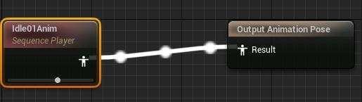

# 애니메이션 몽타주

캐릭터에 달리기 애니메이션이 직진밖에 없어서 옆으로 뛰는 애니메이션만 추가해서  
합칠 수 없을까 했는 데 다행이 있다. 애니메이션 몽타주라고것을 쓰면 여러 애니메  
이션 시퀀스를 단일 에셋으로 결합하고 재생을 제어할 수 있다.

## 애니메이션 시퀀스

근데 애니메이션 시퀀스는 뭘까? 한번 지나친 적은 있긴하다. 상태머신에서의 시퀀스  
플레이어 노드이다. 해당 노드는 애니메이션 시퀀스를 참조한다.  

애니메이션 시퀀스는 캐릭터 애니메이팅을 위해 스켈레탈 메시에서 재생 가능한 애니메이션  
데이터를 포함하는 애셋이다. 특점 시점에서 스켈레탈 메시의 스켈레톤 위치, 회전 및 스케일을  
지정하는 키프레임을 포함한다. 순차적으로 재생하는 동안 여러 키프레임을 블렌딩하여 스켈레톤의  
모션이 메시를 애니메이팅한다. 애니메이션 시퀀스는 특정 스켈레톤과 연결되어 동일한 스켈레톤을  
사용하는 스켈레탈 메시에 공유된다.

## 애니메이션 몽타주

몽타주에서 시퀀스는 슬롯 그룹과 슬롯으로 정리된다. 여러 시퀀스를 단일 슬롯에 저장하여 애니메이  
션을 생성하고 여러 슬롯을 사용하여 추가 트랙을 만들 수 있다. 잠시 에디터에 대해 알아보자.

  
생성 방식은 애니메이션BP와 같다. 스켈레톤을 설정해야한다. 애셋을 열면 애니메이션 시퀀스 에디  
터가 열린다. 처음보니까 패널에 대해서 잠시 알아보자.

  
타임라인은 다른 에디터의 타임라인과 마찬가지로 트랙으로 정리된다. 트랙은 애니메이션 재생의  
행동을 나타내는 정보를 포함하며, 재생 프레임을 정리된다.

몽타주 트랙의 헤더 아래에서 애니메이션 시퀀스 트랙을 추가 및 관리하고 트랙을 슬록 그룹 및  
슬롯별로 정리 할 수 있다. 또한 노티파이를 위한 타이밍 표시기도 있다.

- 애니메이션 노티파이 : 애니메이션 시쿼슨에 동기화된 반복 가능한 이벤트를 생성하는 방법을  
  제공한다. 이벤트 예시로는 달리는 애니메이션에서의 발소리 같은 사운드가 있다.

  
몽타주 트랙내에서 몽타주에있는 섹션에 접근 가능하다. 이는 이름과 보라색 헤더로 표시되며,  
게임 플레이를 위해 섹션을 이용하여 해당 시퀀스 또는 시퀀스 섹션에 매칭할 수 있다.

  
타이밍 트랙은 엘리먼트의 타이밍을 위해 몽타주 및 노타피이 섹션에서 표시기를 제공한다. 각  
노드는 몽타주 내 오브젝트의 트거 순서를 나타내는 숫자가 주어지며, 레퍼런스 타입별로 컬러  
가 지정된다. 섹션은 보라색, 노티파이는 빨간 색이다.

몽타주에서 애니메이션 시퀀스는 슬롯으로 정리되어 재생된다. 슬롯은 메시 또는 그 일부를 차지  
하며, 슬롯으로 배치되면 해당 슬롯의 애니메이션 BP에서 재생될 수 있다. 슬롯 트랙은 일련의  
시퀀스로 시퀀스를 그 수에 관계없이 포함할 수 있다. 애니메이션을 슬롯그룹으로 분할하면 캐릭  
터의 서로 다른 부분에서 시퀀스를 재생할 수 있다.

## 애니메이션 리타겟팅

  
옆뒤로 달리는 애니메이션이 없어서 언리얼에서 제공하는 기본 애니메이션 팩을 추가했다. 문제는  
이게 언리얼 시작시에나오는 기본 마네킹을 베이스로한 파일이라서 애니메이션을 마법사에게 바로  
적용하기는 무리가 있다.

예를 들어서 체형이 다른 캐릭터가 3개가 있다고치자.

이들을 그냥 써도 작동은 하지만 표준 캐릭터의 스켈레탈의 비율에 맞추다보니 체형이 바뀌어 버린다.

  
리타게팅을 하면 방정식을 통해 비율차이를 계산해서 캐릭터의 애니메이션이 제대로 플레이 된다.

애니메이션 리타겟팅은 같은 스켈레톤 애셋을 사용하나 비율이 다른 캐릭터간에 애니메이션을 재사  
용하게 해주는 기능이다. 다른 스켈레톤을 사용하는 캐릭터끼리도 공유는 가능하나 비슷한 본 계층  
구조를 공유하고, 스켈레톤간의 애니메이션 데이터를 전달하는 '릭(Rig)'이라는 애셋을 이용 해야  
한다.

원래 언리얼 엔진 4떄는 스켈레톤 매니저에서 릭을 설정하는 게 있었는데 5에서는 그게 안보인다.  
공식문서도 갱신을 안해 놓았다...

  
  
  
리타게팅 결과로 IK 릭파일과 타게터 파일이 자동 생성되었다. 깜빡하고 정작 대상 애니메이션 시퀀스는
안골랐다. 그래서 방금 생성된 릭파일을 이용해서 다시 리타게팅을 실시했다.

  
  
릭파일에는 본 구조가 서로 어떻게 대응되는 지에 대한 내용이 나와있다. 그냥 리타겟시에 릭을 지정
하도록 절차가 조금 바뀐듯하다. 원리는 같다. 릭 파일을 통해 본 구조를 매핑해줘야한다. 다행히  
기본 마네킹과 마법사의 본 구조가 크게 상이 하지 않다. 손가락이 더 적고 종아리가 없을 뿐이다.

  
달리는 모션을 성공적으로 가져왔다.

그러나 문제가 있다. 몽타주로 재생가능한 게 일반 시퀀스뿐이라서 다른 몽타주나 블렌드 스페이스를  
재생 못 한다. 달리기의 경우 사방으로 재생할 것이라서 블렌드 스페이스가 필요하다. 그 와중에
Layerd Blend Per Bone이라는 노드를 알아 냈다.

## Layerd Blend Per Bone

  
  
애님그래프에서 분기문이 안되서 Run이라는 새로운 상태를 만들고 두 개의 애니메이션을 Layerd Blend  
Per Bone이라는 노드로 합쳤다. 더 많은 포즈를 추가하려면 AddPin으로 하면 된다. 섞는 강도도 설정  
가능하다. bone단위로 섞는 것이 가능하다. 나는 spine_01이라는 본이 상체 애니메이션을 담고 있어서  
이걸로 상체 움직임만 Wizard팩에 있는 것으로 덮어 씌었다. 몽타주도 같은 방식으로 사용하면 된다.  
후에 처리하는 부분만 조금 달라진다.

## 진짜로(?) 몽타주 생성하기(공격편)

그냥 애님 그래프에서 해당 노드로 다 처리되면 굳이 왜 넣나 하겠지만. 두 동작을 동시에 해야하는 경우  
달리면서 공격이나 점프하면서 공격의 경우 상태머신이 조잡해 질 것 같았다. 또는 여러 이벤트가 포함되  
거나 다수의 시퀀스가 연속으로 재생되어야 한다면 몽타주를 고려 해 볼 것같다. 공격 모션을 추가 하자.

  
공격 애니메이션 하나를 UpperBody라는 슬롯에 할당해두었다.

  
애니메이션 BP에서 최종 상태 포즈 두 개를, 하나는 방금 정의한 슬롯에 배정하고, 레이어 블렌드 노드에  
붙여서 상체만 덮어 씌도록 했다.

### 기타 변경 사항

- 달리기 기능 추가
- 공격 애니메이션 추가

#### 참조

- [공식 문서 : 보행이동 기반 블렌딩](https://docs.unrealengine.com/4.27/ko/AnimatingObjects/SkeletalMeshAnimation/AnimHowTo/BlendSpace/)
- [공식 문서 : 애니메이션 몽타주](https://dev.epicgames.com/documentation/ko-kr/unreal-engine/animation-montage-in-unreal-engine?application_version=5.3)
- [공식 문서 : 애니메이션 블루프린트에서 그래프 사용하기](https://dev.epicgames.com/documentation/ko-kr/unreal-engine/graphing-in-animation-blueprints-in-unreal-engine?application_version=5.3)
- [공식 문서 : 애니메이션 시퀀스](https://dev.epicgames.com/documentation/ko-kr/unreal-engine/animation-sequences-in-unreal-engine?application_version=5.3)
- [공식 문서 : 애니메이션 노티파이](https://dev.epicgames.com/documentation/ko-kr/unreal-engine/animation-notifies-in-unreal-engine?application_version=5.3)
- [공식 문서 : 애니메이션 슬롯](https://dev.epicgames.com/documentation/ko-kr/unreal-engine/animation-slots-in-unreal-engine?application_version=5.3)
- [공식 문서 : 애니메이션 리타겟팅](https://dev.epicgames.com/documentation/ko-kr/unreal-engine/animation-retargeting-in-unreal-engine?application_version=5.3)
- [공식 문서 : 애니메이션 리타깃 매니저](https://dev.epicgames.com/documentation/ko-kr/unreal-engine/retarget-manager-in-unreal-engine?application_version=5.3)
- [공식 문서 : 리타게팅된 애니메이션 사용하기](https://dev.epicgames.com/documentation/ko-kr/unreal-engine/using-retargeted-animations-in-unreal-engine?application_version=5.4)
- [공식 문서 : 레이어 애니메이션 사용하기](https://dev.epicgames.com/documentation/ko-kr/unreal-engine/using-layered-animations-in-unreal-engine?application_version=5.3)
- [공식 문서 : UAnimMontage](https://dev.epicgames.com/documentation/en-us/unreal-engine/API/Runtime/Engine/Animation/UAnimMontage)
