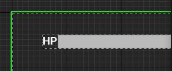
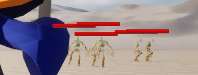

# 언리얼의 위젯

이제 핵심 로직은 다 된듯 하고 UI를 넣어주고 서버 라이브러리로  
넘어갈 생각이다. UI에 연동될 데이터를 갱신하는 부분만 C++로 하고  
디자인에 있어서는 블루프린트로 상속해서 처리하겠다.

## 위젯 블루 프린트 에디터

슬레이트 말고 언리얼 모션 그래픽 UI 디자이너(Unreal Motion Graphics  
 UI Designer, UMG)를 이용해서 만들어 볼 것이다. 생성은 여타 BP와 같다.  
 컨텐츠 브라우저 - 유저 인터페이스 - 위젯 블루프린트를 생성한다.


열어서 보면 패널이 되게 많다.  


1. 메뉴 바 : 일반적인 메뉴 바
2. 툴 바 : 컴파일, 저장, 플레이 등 BP에디터에 자주 쓰이는 함수 포함
3. 에디터 모드 : 디자이너/그래프 모드 전환
4. 팔레트 : 비주얼 디자이너에 배치 가능한 위젯 목록
5. 계층 구조
6. 비주얼 디자이너
7. 디테일
8. 애니메이션

  
캔버스패널을 먼저 배치했다. 패널은 다른 위젯을 담는 컨테이너이다. 내부  
위젯에 추가 함수 기능을 제공할 수 있다.

  
이어서 패널에 수평 박스도 추가했는데 이상한 아이콘이 떴다. 이는 앵커라는  
것으로 캔버스 패널내의 UI위치를 설정하는 데 쓰인다.

  
수평 박스에 텍스트와 프로그레스 바를 넣어서 HP바를 만들었다. UWidget클래스도  
살펴 볼 겸 Wizard의 HP를 가져다가 체력바를 갱신하는 로직을 짜보겠다.

HP바 클래스자체는 Hp세터만 있다. 클래스 의존도를 낮추기 위함이다. 이  
위젯을 적과 플레이어 클래스에 넣어주고 피격시 갱신 하게 하였다. 또한  
화면에 표시하기 위해 AddToViewport()란 함수를 넣어줘야한다.

```c++
UCLASS()
class CASTLEDEFENSE_API UHpBar : public UUserWidget
{
	GENERATED_BODY();

public:
	void SetHp(int hp) { m_hp = hp; };
private:
	UPROPERTY()
	int m_hp;
};

```

근데 c++클래스를 상속한 블루프린트 위젯을 다시 c++에 멤버로 두려는데 좀 복잡해졌다.  
생성자에서 블루프린트로부터 생성하려는 클래스를 기록한다음 BeginPlay에서  
CreateWidget으로 결과 위젯의 Owner에 대한 포인터와 만드려는 유형의 클래스를 전달한다.

```c++
//생성자
static ConstructorHelpers::FClassFinder<UWizardWidget> wizardUIAsset(TEXT("/Script/UMGEditor.WidgetBlueprint'/Game/WizardUI.WizardUI'"));
if (wizardUIAsset.Succeeded())
{
	WidgetClass = wizardUIAsset.Class;
}
//BeginPlay
{
	if (WidgetClass!=nullptr)
	{
		AController* pController = GetController();
		APlayerController* pPlayerController = Cast<APlayerController>(pController);
		m_pWidget = CreateWidget<UWizardWidget>(pPlayerController, WidgetClass);
		m_pWidget->SetHp(m_Hp);
		m_pWidget->AddToViewport();
	}
}
```

특정 클래스들만 위젯 Owner로 설정가능하다.

```c++
WidgetT* CreateWidget(OwnerType OwningObject, TSubclassOf<UUserWidget> UserWidgetClass = WidgetT::StaticClass(), FName WidgetName = NAME_None)

static_assert(TIsDerivedFrom<TPointedToType<OwnerType>, UWidget>::IsDerived
	|| TIsDerivedFrom<TPointedToType<OwnerType>, UWidgetTree>::IsDerived
	|| TIsDerivedFrom<TPointedToType<OwnerType>, APlayerController>::IsDerived
	|| TIsDerivedFrom<TPointedToType<OwnerType>, UGameInstance>::IsDerived
	|| TIsDerivedFrom<TPointedToType<OwnerType>, UWorld>::IsDerived, "The given OwningObject is not of a supported type for use with CreateWidget.");
```

아무리 해도 저 블루프린트를 가져오지 못했는 데 포럼에서 본 대로  
UserWidget'/Game/WizardUI.WizardUI_C'로 바꾸니 되었다.  
StripObjectClass에서는 '사이의 부분을 경로로써 따온다(/Game/WizardUI.WizardUI_C)  
그래서 ''앞에다가 zzzzzzzzzzz같은 걸 넣어도 잘만된다. 언리얼은 모든 BP클래스에 \_C를
붙인다고 한다. 이게 없으면 안돌아간다.

이걸로 FindOrLoadObject를 불러서 .이하의 부분이 없다면 붙여준 뒤 LoadObject를 한다.

```c++

TSubclassOf<T> Class;
FClassFinder(const TCHAR* ClassToFind)
{
	CheckIfIsInConstructor(ClassToFind);
	FString PathName(ClassToFind);
	StripObjectClass(PathName, true);
	Class = ConstructorHelpersInternal::FindOrLoadClass(PathName, T::StaticClass());
	ValidateObject(*Class, PathName, *PathName);
}

void ConstructorHelpers::StripObjectClass( FString& PathName, bool bAssertOnBadPath /*= false */ )
{
	int32 NameStartIndex = INDEX_NONE;
	PathName.FindChar( TCHAR('\''), NameStartIndex );
	if( NameStartIndex != INDEX_NONE )
	{
		int32 NameEndIndex = INDEX_NONE;
		PathName.FindLastChar( TCHAR('\''), NameEndIndex );
		if(NameEndIndex > NameStartIndex)
		{
			PathName.MidInline( NameStartIndex+1, NameEndIndex-NameStartIndex-1, EAllowShrinking::No);
		}
		else
		{
			UE_CLOG( bAssertOnBadPath, LogUObjectGlobals, Fatal, TEXT("Bad path name: %s, missing \' or an incorrect format"), *PathName );
		}
	}
}

template<>
inline UClass* FindOrLoadClass(FString& PathName, UClass* BaseClass)
{
	// If there is no dot, add ".<object_name>_C"
	int32 PackageDelimPos = INDEX_NONE;
	PathName.FindChar(TCHAR('.'), PackageDelimPos);
	if (PackageDelimPos == INDEX_NONE)
	{
		int32 ObjectNameStart = INDEX_NONE;
		PathName.FindLastChar(TCHAR('/'), ObjectNameStart);
		if (ObjectNameStart != INDEX_NONE)
		{
			const FString ObjectName = PathName.Mid(ObjectNameStart + 1);
			PathName += TCHAR('.');
			PathName += ObjectName;
			PathName += TCHAR('_');
			PathName += TCHAR('C');
		}
	}
	UClass* LoadedClass = StaticLoadClass(BaseClass, NULL, *PathName);
	if (LoadedClass)
	{
		LoadedClass->AddToRoot();
	}
	return LoadedClass;
}

UClass* StaticLoadClass( UClass* BaseClass, UObject* InOuter, const TCHAR* InName, const TCHAR* Filename, uint32 LoadFlags, UPackageMap* Sandbox )
{
	check(BaseClass);

	UClass* Class = LoadObject<UClass>( InOuter, InName, Filename, LoadFlags, Sandbox );
	if( Class && !Class->IsChildOf(BaseClass) )
	{
		// return NULL class due to error
		Class = NULL;
	}

	return Class;
}

template< class T >
inline T* LoadObject( UObject* Outer, const TCHAR* Name, const TCHAR* Filename=nullptr, uint32 LoadFlags=LOAD_None, UPackageMap* Sandbox=nullptr, const FLinkerInstancingContext* InstancingContext=nullptr )
{
	return (T*)StaticLoadObject( T::StaticClass(), Outer, Name, Filename, LoadFlags, Sandbox, true, InstancingContext );
}
```

다만 몬스터들의 경우 위젯 위치가 계속 바뀌어야한다. 그래서 위젯 컴포넌트를 만들고  
위젯을 세팅해줘야한다. AddToViewport를 하면 이런 사달이 난다.  
  
굳이 이걸 호출안해도 렌더링은 된다. 또한 뒷면도 보여야한다.

```c++
//생성자
m_pWidgetComponent = CreateDefaultSubobject<UWidgetComponent>(TEXT("EnemyHPBar"));
static ConstructorHelpers::FClassFinder<UUserWidget> enemyUIAsset(TEXT("UserWidget'/Game/EnemyUI.EnemyUI_C'"));
if (enemyUIAsset.Succeeded())
{
	UE_LOG(LogTemp, Display, TEXT("GotBluePrintUIClass"));
	m_pWidgetComponent->SetupAttachment(m_pSkeletalMeshComponent);
	WidgetClass = enemyUIAsset.Class;
}

//BeginPlay
if (WidgetClass != nullptr)
{
	UWorld* pWorld = GetWorld();
	if (pWorld!=nullptr)
	{
		m_pWidget = CreateWidget<UEnemyWidget>(pWorld, WidgetClass);
		if (m_pWidget != nullptr)
		{
			m_pWidget->SetHp(m_Hp);
			m_pWidgetComponent->SetWidget(m_pWidget);
			m_pWidgetComponent->SetRelativeLocation(FVector(0.0f, 0.0f, 200.0f));
			m_pWidgetComponent->SetDrawSize(FVector2D(100.0f, 10.0f));
			m_pWidgetComponent->SetTwoSided(true);
		}
	}

}
```

  
근데 보면 HP가 플레이어 카메라를 정면으로 보고 있지 않다. 굳이 복잡하게 하지않고  
월드 공간이 아닌 스크린에 그리도록 설정했다.

```c++
m_pWidgetComponent->SetWidgetSpace(EWidgetSpace::Screen);
```

  
  
프로그세스 바의 퍼센트는 0~1.0f으로 설정되니 계산에 유의

### 기타 변경 사항

- AddOnScreenDebugMessage에서 UE_LOG로 변경
- 전방선언으로 컴파일 의존성 감소
- 유니티 빌드 끔

#### 참조

- [공식 문서 : UMG UI 디자이너 퀵스타트 가이드](https://dev.epicgames.com/documentation/ko-kr/unreal-engine/umg-ui-designer-quick-start-guide-in-unreal-engine?application_version=5.3)
- [공식 문서 : 위젯 블루프린트](https://d1iv7db44yhgxn.cloudfront.net/documentation/images/cb334b0a-dcbe-41cd-9364-21bbb5ef3611/ue5_1-04-widget-editor-scheme.png)
- [공식 문서 : UMG 앵커](https://dev.epicgames.com/documentation/ko-kr/unreal-engine/umg-anchors-in-unreal-engine-ui?application_version=5.3)
- [공식 문서 : 위젯 만들기](https://dev.epicgames.com/documentation/ko-kr/unreal-engine/creating-widgets-in-unreal-engine?application_version=5.3)
- [UMG Widgets with C++ in Unreal Engine 5](https://www.youtube.com/watch?v=T7v3UnL6PNU)
- [블루프린트 클래스를 못찾는 문제](https://forums.unrealengine.com/t/can-t-find-widget-blueprint-class/382657)
- [공식 문서 : UWidgetComponent](https://dev.epicgames.com/documentation/en-us/unreal-engine/API/Runtime/UMG/Components/UWidgetComponent?application_version=5.3)
- [몬스터 체력바 만들기](https://www.youtube.com/watch?v=PiPq3q1CXyM&t=268s)
- [언리얼 위키 : \_C 접두어](https://unrealcommunity.wiki/6100e8179c9d1a89e0c34612)
