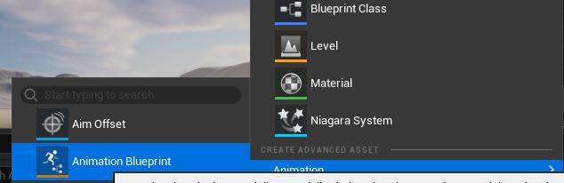
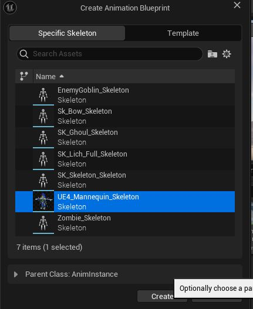
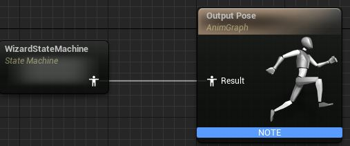
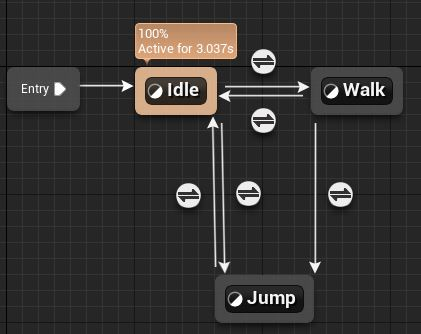
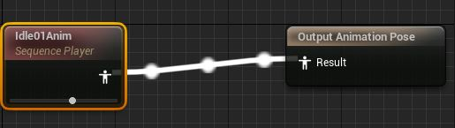
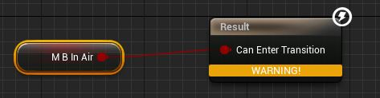

# 캐릭터 애니메이션

캐릭터 메시와 움직임을 추가 했지만 여전히 T자 포즈를 취하고 있다.
애니메이션을 추가함으로써 언리얼엔진의 애니메이션 구현에 대해 알아보자.

## 애니메이션 BP생성

이미 컨텐츠 팩에 애니메이션 파일이 다 있어서 애니메이션 fbx파일들을 가져오는 부분은 생략했다.  
  
컨텐츠 브라우저에서 애니메이션 - 애니메이션BP를 선택한다.  
  
부모 클래스로 AnimInstance클래스를 선택하고 스켈레톤은 Wizard의 그 것으로 선택하여 생성한다.

블루프린트는 여러 유형이 있지만 생성시에 기반이 되는 부모 클래스를 지정해줘야한다. 지금의 경우는
UAnimInstance이다.

- UAnimInstance : 정작 공식문서에서는 아무런 언급은 없고 애니메이션에 관한 온갖 멤버 변수/함수가
  가득하다.

  

- skeleton : 스켈레톤은 스켈레탈 메시 내의 본(조인트)들의 정의하는 데 사용되는 계층구조다. 이러한  
  본은 그 위치와 캐릭터가 변형 되는 방식을 제어하는 기능 떄문에 실제 생물학적 골격을 모방한다.
  언리얼 엔진에서 스켈레톤은 애니메이션 데이터와 전반전인 스켈레탈 계층구조 및 애니메이션 시퀀스를  
  저장하고 연결하는 데 사용 된다. 스켈레톤 애셋도 다양한 방법을 통해 공유하여 여러 스켈레톤 간에 추가
  애니메이션과 데이터를 공유 할 수 있다.

  ??스켈레탈 트리에 대한 설명이 있는데 봐도 감이 안잡힌다.??

[애니메이션 그래프](애니메이션%20그래프.JPG)  
BP를 열어보면 이벤트 그래프와 애님 그래프라는 것이 보인다. 이 둘을 통해 로직을 생성하는데 이 로직으로  
BP의 포즈 비헤이비어, 변수 및 기타 프로퍼티를 정의한다. 이러한 그래프는 함께 작동하여 주어진 프레임에  
최종 출력 포즈를 제공한다.


- 이벤트 그래프 : 블루프린트와 연관된 게임플레이 이벤트에 대한 응답으로써 특정 동작을 수행하기 위해
  이벤트와 함수 호출을 이용한다. 이벤트 그래프 자체는 어느 BP에나 있다. 애니메이션BP의 경우 애님 그래프
  노드에서 사용 할 값이나 프로퍼티를 갱신 하는 게 일반적인 경우다.

당장은 정지/걷기/점프 이 세가지 애니메이션을 도입할 것이라서 필요한 변수는 속도, 점프여부가 있다.  
  
이렇게 노드로 구성해도 되지만 UAnimInstance를 상속한 클래스를 만들고 나만의 로직을 NativeUpdateAnimation  
함수에다가 넣어도 결과는 같다고 한다. C++하면 나중에 다른 BP만들 때 부모로 재활용이 가능하다. 더군다나
BP특성상 로직이 조금만 복잡해지면 읽기도 복잡해지니 말다했다.

```c++
void UWizardAnimInstance::NativeInitializeAnimation()
{
	UAnimInstance::NativeInitializeAnimation();
	m_pOwner = TryGetPawnOwner();
}

//void UAnimInstance::InitializeAnimation(bool bInDeferRootNodeInitialization)

	{
#if DO_CHECK
		// Allow us to validate callbacks within user code
		FGuardValue_Bitfield(bInitializing, true);
#endif

		NativeInitializeAnimation();
		BlueprintInitializeAnimation();
	}
```

NativeInitializeAnimation() 함수를 오버라이드해서 AnimInstance 초기화 시에  
필요한 초기화를 할 수있다. NativeInitializeAnimation()함수 자체는 텅비였고  
InitializeAnimation()에서만 호출 된다. 여기서 현 폰을 가져와 저장한다.

```c++
APawn* UAnimInstance::TryGetPawnOwner() const
{
	USkeletalMeshComponent* OwnerComponent = GetSkelMeshComponent();
	if (AActor* OwnerActor = OwnerComponent->GetOwner())
	{
		return Cast<APawn>(OwnerActor);
	}

	return NULL;
}

USkeletalMeshComponent* UAnimInstance::GetSkelMeshComponent() const
{
	return CastChecked<USkeletalMeshComponent>(GetOuter());
}

//UObjectBase.h
/** Returns the UObject this object resides in */
FORCEINLINE UObject* GetOuter() const
{
	return OuterPrivate;
}
```

갑자기 Outer라는 개념이 등장하는 데, 오브젝트 소유를 정의한다고 한다. 그건 그렇다치고
스켈레탈 메시가 애니메이션을 갖는 다는 구조가 직관적이지는 않았다.

```c++
//USkeletalMeshComponent.h
/* The AnimBlueprint class to use. Use 'SetAnimInstanceClass' to change at runtime. */
UPROPERTY(EditAnywhere, BlueprintReadOnly, Category = Animation)
class TSubclassOf<UAnimInstance> AnimClass;

/** The active animation graph program instance. */
UPROPERTY(transient, NonTransactional)
TObjectPtr<UAnimInstance> AnimScriptInstance;


//...
bool USkeletalMeshComponent::InitializeAnimScriptInstance(bool bForceReinit, bool bInDeferRootNodeInitialization)
{
	bool bInitializedMainInstance = false;
	bool bInitializedPostInstance = false;

	if (IsRegistered())
	{
		USkeletalMesh* SkelMesh = GetSkeletalMeshAsset();
		check(SkelMesh);

		if (NeedToSpawnAnimScriptInstance())
		{
			SCOPE_CYCLE_COUNTER(STAT_AnimSpawnTime);
			AnimScriptInstance = NewObject<UAnimInstance>(this, AnimClass);
      ...
    }
    ...
  }
  ...
}
```

이전에 등록한 AnimInstance클래스에대한 인스턴스를 생성해서 등록하는 코드가 보인다. 그래서 Outer관계가  
성립하는가 보다.

```c++
void UWizardAnimInstance::NativeUpdateAnimation(float DeltaTimeX)
{
	UAnimInstance::NativeUpdateAnimation(DeltaTimeX);

	if (m_pOwner&&m_pOwner->IsA(ACharacter::StaticClass()))
	{
		ACharacter* pCharacter = Cast<ACharacter>(m_pOwner);
		if (pCharacter)
		{
			m_bInAir = pCharacter->GetMovementComponent()->IsFalling();
			m_speed = pCharacter->GetVelocity().Size();
		}
	}
}

//void UAnimInstance::UpdateAnimation(float DeltaSeconds, bool bNeedsValidRootMotion, EUpdateAnimationFlag UpdateFlag)

	{
		SCOPE_CYCLE_COUNTER(STAT_NativeUpdateAnimation);
		CSV_SCOPED_TIMING_STAT(Animation, NativeUpdate);
		NativeUpdateAnimation(DeltaSeconds);
	}

```

마찬가지로 NativeUpdateAnimation()도 속은 비었고 UAnimInstance::UpdateAnimation()함수에서만 호출된다.
Tick()마냥 갱신이 필요할 떄 쓴다. 그래서 여기서 Owner의 값을 계속 가져오도록한다.

- 애님 그래프 :

  
  
이벤트 클래스와 마찬가지로 노드 그래프 방식이다. 결과로는 선택된 애니메이션이 나온다.  
근데 문제가 있는 데 이런 식으로 하면 애니메이션이 고정된다. 여기에 상태머신을 도입해야한다.

  
그래프에서 Add StateMachine을 하고 연결하자. 그리고 상태머신 노드를 더블 클릭하면 또 다른 그래프가  
보인다.  
  
상태 노드를 생성하여 서로 이어준다. 지금은 정지/걷기/점프 세 개만 만들어 두었다.  
  
이 상태 노드를 더블 클릭하여 무슨 애니메이션을 쓸 지를 정할 수 있다.  
  
커스텀 애님 인스턴스에 선언한 변수를 가져와서 조건문으로 쓰자.

마지막으로 완성된 BP를 스켈레탈 메시에다가 설정해주면 된다.

```
static ConstructorHelpers::FObjectFinder<UAnimBlueprint> wizardAnimBP
(TEXT("/ Script / Engine.AnimBlueprint'/Game/BattleWizardPolyart/Animations/WizardAnImBP.WizardAnImBP'"));
m_pSkeletalMeshComponent->SetAnimInstanceClass(wizardAnimBP.Object->GeneratedClass);
```

걷기 애니메이션이 반복 재생되지 않고 좌우로 걸을 때 이상하다.
  
루프는 상태노드에서 애니메이션 노드 속성에 loop여부만 바꿔주면 된다. 문제는 옆으로 걸을 때인데  
옆으로 걷는 애니메이션은 전투중에 옆으로 걷는 것만 있고 평범하게 옆으로 걷는 건 없다. 그래서  
그냥 상하좌우 입력만 구분해서 전투+옆으로 걷는 모션으로 하기로 했다. 그래서 상태를 상하좌우 4개로
해야 하나 싶었는데 블렌드 스페이스라는 게 있었다.

- 블렌드 스페이스 : 원하는 수의 애니메이션을 구성하여 여러 입력값에 따라 서로 블렌딩할 수 있는 그래프
  애니메이션 블루프린트 내에서 이 애셋을 참조 할 수 있다.

  
  
  
애니메이션BP 만들떄와 같이 스켈레톤을 지정하여 생성한다. BS를 에디터로보면 중앙하단에 그래프가 나온다.  
  
축(Axis) 설정을 좌측 패널에서 설정 가능하다. 원하는 구상대로 애니메이션을 그래프에 배치 시기면 된다.


방향 값도 필요해서 Anim인스턴스에 변수를 추가 했다.  


### 기타 변경 사항

#### 참조

- [공식 문서 : 캐릭터 애니메이션 추가하기](https://dev.epicgames.com/documentation/ko-kr/unreal-engine/adding-character-animation-in-unreal-engine)
- [공식 문서 : UAnimInstance](https://dev.epicgames.com/documentation/en-us/unreal-engine/API/Runtime/Engine/Animation/UAnimInstance?application_version=5.4)
- [공식 문서 : 블루프린트 클래스 작업하기](https://dev.epicgames.com/documentation/ko-kr/unreal-engine/blueprint-class-assets-in-unreal-engine)
- [공식 문서 : 애니메이션 블루프린트에서 그래프 사용하기](https://dev.epicgames.com/documentation/ko-kr/unreal-engine/graphing-in-animation-blueprints-in-unreal-engine)
- [공식 문서 : 이벤트 그래프](https://dev.epicgames.com/documentation/ko-kr/unreal-engine/event-graph-in-unreal-engine?application_version=5.3)
- [Override AnimInstance](https://jollymonsterstudio.com/2019/01/12/unreal-engine-c-fundamentals-override-uaniminstance/)
- [공식 포럼 : Outer오브젝트의 목적](https://forums.unrealengine.com/t/what-is-the-purpose-of-a-uobjects-outer/647169/4)
- [8 Way Directional Movement ](https://www.youtube.com/watch?v=OSWX3vEgRcE)
- [공식 문서 : 블렌드 스페이스](https://dev.epicgames.com/documentation/ko-kr/unreal-engine/blend-spaces-in-unreal-engine)
