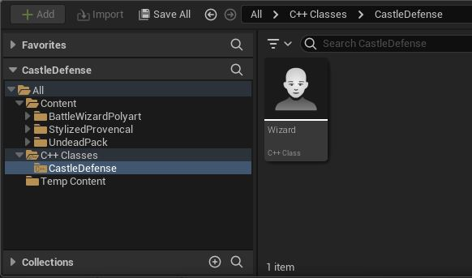
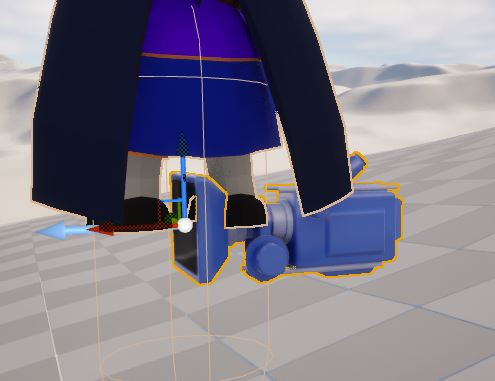

# 캐릭터 생성


프로젝트를 실행하면 사막 말고는 아무 것도 없다. 그래서 오늘은 사용자가  
조작 가능한 캐릭터를 생성하고 움직이는 걸 해볼것 이다.


현재 공간에 뭐라도 추가 해보려고 이것 저것 누르다가 발견했다. 그런데  
액터, 폰, 캐릭터 뭔가 헷갈린다. 이참에 클래스 구조를 파헤치기로 했다.  
일일이 클래스를 다 따라가고는 싶지만 그럴 능력도 시간도 아직 안된다.  
엄청 상세하게 엔진코드 분석을 나중에 해볼예정이다. 지금은 컨텐츠 개발시  
자주 보는 것 위주로 간단하게 보겠다.

## 오브젝트 - 폰 - 캐릭터 클래스

```c++
class UObject : public UObjectBaseUtility
```

언리얼엔진에서 가장 기본적인 클래스로 언리얼엔진에서 거의 모든 것이 이를 상속 한다.  
가비지 컬렉션, 언리얼 에디터에 변수를 노출하기 위한 메타데이터(UProperty)지원, 로딩 및  
저장 직렬화 등의 기능을 구현한다.
&nbsp;  
&nbsp;

```c++
class AActor : public UObject
```

액터는 카메라, 스태틱 메시, 플레이어 시작 위치 같이 레벨에 배치 할 수 있는 모든 오브젝트를  
가리킨다. 액터는 3D 변환이 가능하고 생성/소멸 가능하다.
&nbsp;  
&nbsp;

```c++
class APawn :
    public AActor,
    public INavAgentInterface
```

폰은 액터의 서브 클래스로, 플레이어 또는 AI로 제어되는 NPC등에 쓰인다.  
인간이나 AI가 폰을 제어하면 Possessed되었다고 한다.  
&nbsp;  
&nbsp;

```c++
class ACharacter : public APawn
```

캐릭터는 플레이어가 사용하기 위한 폰의 서브 클래스다. 충돌 처리, 플에이어의  
움직임을 제어하는 코드가 추가 되어있다.

## 캐릭터 클래스 생성

  
에디터에서 상단의 Tools탭을 누르면 C++로 클래스를 추가 할 수 있는 기능이 보인다.  
&nbsp;  
  
상속할 클래스를 선택하고 생성 하면 된다.  
&nbsp;  
  
성공적으로 프로젝트에 .h파일 및 .cpp파일이 추가되었다. 코딩 표준때문에 액터를 상속한  
캐릭터를 상속한 클래스라서 앞에 A라는 접두어가 보인다. 프로젝트를 빌드하면
해당 클래스가 컨텐츠 브라우저에서 보인다.  
&nbsp;  
  
생성은 잘되었지만 만든 클래스에 아무런 멤버도 없어서 표시 되는 것도 없다.

&nbsp;  
  
보통의 C++프로젝트 와는 다른 구성이라 당황했다. 언리얼엔진은 UnrealBuildTool이라는  
커스텀 빌드 메서드를 사용한다. 이 툴은 엔진의 리플렉션 시스템을 빌드하는 데 필요한 정보를  
처리해 주어, C++ 코드를 블루프린트, 리플리케이션, 시리얼라이제이션, 가비지 컬렉션과 통합  
시켜준다.  
&nbsp;  
모든 빌드 구성에는 두 개의 키워드가 있다. 하나는 엔진과 게임 프로젝트의 상태를 나타내고  
다른 하나는 빌드 타깃을 나타낸다.

빌드 환경 - 상태

- 디버그 : 최적화 없이 엔진과 게임코드 둘다 빌드. 속도가 느린대신에 디버깅이 용이  
  디버그 상태로 프로젝트를 컴파일하고 에디터로 열고 싶다면 반영된 변경 사항을 보기위해  
  -debug 플래그를 추가해야한다.
- 디버그 게임: 최적화 없이 게임코드를 빌드한다. 게임 모듈만 디버깅하는 용도로 적합
- 개발 : 시간이 많이 걸리는 엔진 및 게임 코드 최적화를 뺴고 모든 작업이 가능하므로 개발 및  
  퍼포먼스 이유로 쓰기에 적합. 에디터는 기본적으로 '개발' 환경 설정을 쓴다.
- 배포(shipping): 퍼포먼스 최적화 및 게임 배포용. 콘솔 명령, 통계, 프로파일링 툴을 제거
- 테스트 : 배포와 동일하지만 일부 콘솔 명령, 통계, 프로파일링 툴이 활성화
  &nbsp;

빌드 환경 - 타깃

- 게임 : 독립형 실행 버전을 빌드. 플랫폼에 특정한 쿠킹된 콘텐츠 필요
- 에디터 : 에디터에서 반영된 변경사항을 보려면 이것으로 설정
- 클라이언트 : UE 네트워킹 기능을 이용하여 프로젝트를 작업하는 경우 현 프로젝트를  
  클라이언트-서버 모델의 클라이언트로 지정
- 서버 : UE 네트워킹 기능을 이용하여 프로젝트를 작업하는 경우 현 프로젝트를  
  클라이언트-서버 모델의 서버로 지정

## 게임플레이 클래스 분석

```c++
#include "Wizard.generated.h"
```

각 게임플레이 클래스 소스 파일 위에는 클래스에 대해 (자동 생성되는) 제너레이티드 헤더를  
포함시켜야한다. 정작 솔루션 탐색기에서는 찾을 수는 없다. 저게 왜 필요한지 알려면 먼저  
리플렉션 시스템이란 것을 알아야한다.

Reflection은 프로그램이 실행 중에 자기 자신을 조사하는 기능이다. 언리얼의 근간을 이루며  
 에디터의 디테일 패널, 시리얼라이제이션, 가비지 컬렉션, 네트워크 리플리케이션, BP/C++간  
커뮤니케이션 등 다수의 시스템에 탑재되어있다. 허나 C++자체는 어떠한 리플렉션도 없어서  
언리얼에서는 C++ 클래스, 구조체, 함수, 멤버 변수, 열거형 관려 정보를 수집, 질의 조작하는  
별도의 시스템을 구축 했다. 이 시스템은 옵션이다. 리플렉션 시스템에 보이려는 유형이나  
프로퍼티에 주석을 달면 Unreal Header Tool이 그 프로젝트를 컴파일할 때 해당 정보를 수집한다.

헤더에 리플렉션이 있는 유형으로 마킹하려면 특수한 인클루드를 해서 UHT에 알려야한다. 그 헤더가  
'파일이름\_generated.h'인것이다. 이제 UENUM(),UCLASS(),USTRUCT(),UFUNCTION(),UPROPERTY()와  
같은 메타데이터 지정자를 사용할 수 있다. 메타데이터는 에디터에만 존재함에 유의해야한다. 이를 통해  
우리는 엔진 및 에디터와 상호작용하는 방식을 제어 할 수있다. 다시 클래스 코드로 돌아가자.

```c++
UCLASS([specifier, specifier, ...], [meta(key=value, key=value, ...)])
```

메타데이터 지정자 말고도 클래스 지정자가 따로있어서 클래스가 엔진 및 에디터와 상호작용하는 것을  
제어 할 수 있고 UCLASS() 매크로를 통해 전달 된다.

```c++
class CASTLEDEFENSE_API AWizard : public ACharacter
```

현 프로젝트가 클래스를 다른 모듈에 노출시려면 '프로젝트명\_API'를 지정해야한다. 이는 게임 프로젝트에  
포함될 모듈이나 플러그인에 가장 유용하며 여러 프로젝트에 걸쳐 이식 가능하고 자체 포함된 함수 기능을  
제공하기 위해 의도적으로 클래스를 노출합니다.

```c++
GENERATED_BODY()
```

이 매크로는 실행인자는 없지만 엔진에 필요한 인프라를 지우너하기 위해 클래스를 구성한다. 모든 UCLASS 및  
USTRUCT에 필요하다.

```c++
virtual void BeginPlay() override;
```

액터 스폰의 마지막 단계에서 호출하는 함수이다. 오버라이드하려면 부모 클래스의 것을 먼저 호출해야한다.

```c++
virtual void Tick(float DeltaTime) override;
```

티킹은 액터가 언리얼 엔진에서 업데이트되는 방식을 나타낸다. 모든 액터는 프레임마다, 또는 사용자 정의 간격  
마다 틱할 수 있다.

```c++
virtual void SetupPlayerInputComponent(class UInputComponent* PlayerInputComponent) override;
```

APawn의 함수로 사용자 입력을 처리한다. 오버라이딩해서 원하는 동작을 매핑할 수 있다.

## 컴포넌트 추가

컴포넌트는 액터에 추가할 수 있는 기능 조각이다. 단독으로는 존재 불가능하다.  
액터에 컴포넌트를 추가하면 액터는 그 컴포넌트의 기능을 사용할 수 있다. 예를  
들면 스포트 라이트 컴포넌트는 빛을 내고, 오디오 컴포넌트는 사운드를 재생한다.  
비슷하게 플레이어 캐릭터는 CharacterMovementComponent, CapsuleComponent,  
SkeletalMeshComponent의 통해서 이동에 특화 된다.

- CharacterMovementComponent : 다른 클래스에서는 구현할 수 없다. 설정가능한  
  물리량 프로퍼티들이 포함 되어있다. 애니메이션에서 오는 루트 모션 파라미터도  
  포함하며 월드 공간에서 변환된다.

- CapsuleComponent : 이동 컬리전에 이용된다. CharacterMovementComponent에 대한  
  복잡한 기하 계산을 위해 캡슐모양이라는 가정을 한다.

- SkeletalMeshComponent : 스켈레탈 메시는 캐릭터의 기본 에셋으로, 비주얼 메시나  
  캐릭터의 지오메트리 모델 렌더, 그리고 캐릭터 애니메이팅에 사용되는 본(또는 조인트)  
  데이터가 들어 있는 스켈레톤이 포함된다.

이중에 스켈레탈 메시 컴포넌트를 추가하고 인풋 컴포넌트를 오버라이딩 하겠다.

```c++
template<class TReturnType, class TClassToConstructByDefault>
TReturnType * CreateDefaultSubobject
(
    FName SubobjectName,
    bool bTransient
)


CreateDefaultSubobject<USkeletalMeshComponent>(TEXT("WizardMesh"));
```

CreateDefaultSubobject<T>()는 컴포넌트 또는 하위오브젝트를 만드는데 쓰인다.
하위 클래스를 만들고 부모 클래스를 반환한다.(?)

템플릿 인자가 하나로도 되는 이유는 여러버전이 있고 컴파일러가 적합한 걸 가져다 쓰기 떄문이다.  


TEXT()매크로는 WCHAR로 바꾸기 위함이다. L을 앞에 붙여준다. 멤버변수는 생성했으나 애셋이 없다.
애셋 참조 방식은 다양하지만 생성자 호출시에 참조하도록 하겠다.

```c++
static ConstructorHelpers::FObjectFinder<USkeletalMesh> wizardAsset(TEXT("/Game/BattleWizardPolyart/Meshes"));

//FObjectFinder
TObjectPtr<T> Object;
FObjectFinder(const TCHAR* ObjectToFind, uint32 InLoadFlags = LOAD_None)
{
	CheckIfIsInConstructor(ObjectToFind);
	FString PathName(ObjectToFind);
	StripObjectClass(PathName,true);

	Object = ConstructorHelpersInternal::FindOrLoadObject<T>(PathName, InLoadFlags);
	ValidateObject( Object, PathName, ObjectToFind );
}
```

ConstructorHelpers는 메모리에서 에셋을 찾아보고 없으면 로드합니다. 에셋이 없거나 오류가 발생하면
nullptr를 반환합니다. 단 생성 단계에서 호출 되어야한다.

```c++
if (wizardAsset.Succeeded())
{
	m_pSkeletalMesh->SetSkeletalMesh(wizardAsset.Object);
}
```

성공적으로 호출되었다면 Object(TObjectPtr)변수를 넘겨서 설정한다.
  
허나 캐릭터 자체의 위치와는 다르게 스켈레탈 메시는 원점에 있다.

```c++
m_pSkeletalMesh->SetupAttachment(RootComponent);
```

컴포넌트에는 크게 세가지 클래스가 있다.

- UActorComponent : 움직임, 인벤토리, 어트리뷰트 관리 및 기타 비물리적 개념같은 추상적 동작에 유용.
  공간변환이 없다.
- USceneComponent : 기하 표현이 필요없는 위치 기반 동작을 한다. 카메라, 물리적 힘, 오디오 등등.
- UPrimitiveComponent : 씬 컴포넌트의 자손 클래스. 기하 표현이 있고 주로 시각적 표현 이나 물리적  
  충돌 표현 등에 사용된다. 컬리전 볼륨, 메시, 파티클 시스템이 포함된다.

오직 씬 컴포넌트와(그 자손 클래스, 메시 컴포넌트 및 충돌 컴포넌트들)만이 서로 어태치 가능한 데  
자손과 부모 컴포넌트 간의 공관적 관계를 설명하기 위함이다. 메시 컴포넌트를 루트 컴포넌트, 액터클래스  
멤버 변수로 있는 씬컴포넌트, 에 attach해주었더니 이제 제대로 동작한다.  


## 이동 컴포넌트

이제 뭐가 보이니까 캐릭터를 움직이고 싶다. 그러기 위해서는 SetupPlayerInputComponent()를 오버라이드  
해야한다.

```c++
Super::SetupPlayerInputComponent(PlayerInputComponent);
```

부모로서 함수를 먼저 호출해서 상속된 바이딩도 지원해야한다.

```c++
PlayerInputComponent->BindAction(FName("MyAction"), IE_Released, this, &AMyPawn::OnActionReleased);
PlayerInputComponent->BindAxis("Move_Forward", this, &AWizard::MoveForward);
```

그러고 나서 BindAction()이란 함수로 바인딩을 설정하면 되는데 각 인자는 다음과 같다.
BindAxis()는 이벤트 종류 인자를 받지 않는 차이가 있다.

1. 액션 매핑의 이름. 프로젝트 세팅의 그것과 같아야한다.
2. 바인딩하려는 이벤트 종류. 키 누름, 키 뗌 같은 것이다.
3. 인풋 이벤트를 처리할 개체에 대한 포인터
4. 인풋 이벤트를 처리할 함수에 대한 포인터

에디터 - 프로젝트 설정 - 인풋에서 앞뒤좌우 이동에 대한 키 매핑을 해주었다.


```c++
void AWizard::MoveForward(float value)
{
	FVector dir = FRotationMatrix(Controller->GetControlRotation()).GetScaledAxis(EAxis::X);
	AddMovementInput(dir, value);
}
```

회전 행렬을 가져와서 x축을 곱하여서 어디가 앞인지 확인한다. 근데 여기서 컨트톨러라는 게 등장한다.

컨트롤러는 폰 또는 캐릭터같이 폰의 파생 클래스를 빙의하여 동작을 제어하는, 눈에 안 보이는 액터다.  
파생 클래스로 플레이어/AI 컨트롤러가 있다. 컨트롤러는 제어중인 폰에 발생하는 이벤트 알림을 받는다.  
컨트롤러는 그 이벤트를 가로채서 폰의 기본동작을 대체하는 동작을 구현 할 수 있다.

ControlRotation값은 빙의 중인 폰이 보는 방향을 결정한다. FRotator를 반환하며 Pitch, Yaw, Roll값을  
담는다. 이를 통해 FRotationMatrix를 만들고 축과 곱하여서 방향을 얻는다. 근데 방향이 DirectX의 것과  
좀 상이 하다. X가 앞뒤, Y가 좌우, Z가 위아래이다. 그리고 왼손 좌표계다.

AddMoveMentInput 함수는 value값으로 scale된 월드 벡터 방향으로 이동 입력을 추가한다. 음수이면  
반대로 이동한다. 폰 클래스 자체는 자동으로 이동을 적용하지 않고 사용자가 tick이벤트에서 처리해야한다.  
캐릭터같은 하위 클래스는 자동으로 처리한다.

마우스를 상하좌우로 움직이는 것도 감안해야한다.

```c++
PlayerInputComponent->BindAxis("Turn", this, &AFPSCharacter::AddControllerYawInput);
PlayerInputComponent->BindAxis("LookUp", this, &AFPSCharacter::AddControllerPitchInput);
```

폰 클래스에 있는 AddControllerYaw/PitchInput을 쓰는 데 안을 들여다 보면 폰에서 컨트롤러를
플레이어 컨트롤러로 캐스팅하여 회전 값을 더하는 함수를 호출하는 게 다이다.

```c++
void APawn::AddControllerPitchInput(float Val)
{
	if (Val != 0.f && Controller && Controller->IsLocalPlayerController())
	{
		APlayerController* const PC = CastChecked<APlayerController>(Controller);
		PC->AddPitchInput(Val);
	}
}


void APlayerController::AddPitchInput(float Val)
{
	RotationInput.Pitch += !IsLookInputIgnored() ? Val * (GetDefault<UInputSettings>()->bEnableLegacyInputScales ? InputPitchScale_DEPRECATED : 1.0f) : 0.0f;
}
```

점프의 경우 ACharacter 클래스내에 bPressedJump라는 변수로 점프를 기본 지원한다.  
bindAxis와 마찬가지로 처리해주자.

```c++
	PlayerInputComponent->BindAction("Jump", IE_Pressed, this, &AWizard::StartJump);
	PlayerInputComponent->BindAction("Jump", IE_Released, this, &AWizard::StopJump);

  void AWizard::StartJump()
  {
    bPressedJump = true;
  }

  void AWizard::StopJump()
  {
    bPressedJump = false;
  }
```

기껏 실행했더니 캐릭터는 고정되어있고 카메라만 전지적 시점(?)으로 맵을 둘러 볼 뿐이다 왜 일까?  
에디터에서 실행해보면 못 보던 오브젝트들이 자동 생성 된 게 보인다.  
  
  


## 게임 모드와 레벨, 월드

플레이중인 게임의 정보를 처리하는 클래스는 크게 GameMode와 GameState, 둘이다. 게임 스테이트는 후에  
관련 작업을 할때 다루겠다.

게임모드는 플레이에 필요한 인원 수, 참가 방식 등의 기본요소의 규칙을 설정한다. 한 레벨의 하나의 게임  
모드만 존재한다. 4.14버전 부터 AGameMode의 간소화 버전인 AGameModeBase클래스가 추가되었다.  
게임 모드 액터는 UGameEngine::LoadMap()에서 레벨을 초기화 할때마다 인스턴스가 만들어진다.

- 레벨(Level) : 개발자가 정의하는 게임플레이 영역이다. 레벨에는 메시, 폰, 액터 등과 같이 플레이어가  
  보고 상호작용할 수 있는 모든 것을 포함한다. 언리얼 엔진은 각 레벨을 .umap이라는 포맷으로 저장하는 데  
  그래서 맵이라고 불리기도 한다.

- 월드(World) : 게임을 구성하는 모든 레벨이 담긴 컨테이너이다. 레벨의 스트리밍과 다이내믹 애턱의 생성을  
  처리한다.

AGameMode는 AGameModeBase의 서브클래스로, 멀티플레이 경기 및 기존 작동방식을 지원하기 위한 부가함수가  
있다. 새 프로젝트는 기본으로 Base버전을 쓰지만, 부가 함수가 필요하면 AGameMode를 상속하도록 전환 할 수  
있다. AGameMode에는 게임 플레이의 흐름 상태를 기록하는 스테이트 머신이 있다.

게임 모드 클래스에서 파생된 블루프린트를 만들고 이를 사용하는 것이 가능하다. 다음과 같은 기본 값이 있다.

- 기본 폰 클래스
- HUD 클래스
- 플레이어 컨트롤러 클래스
- Spectator 클래스
- Game State 클래스
- Player State 클래스

프로젝트 세팅에서 디폴트 게임모드를 설정한다. 디폴트 게임모드가 설정된 상태에서 월드 세팅 패널에서  
각 레벨에 고유한 세팅을 적용 할 수 있다. 게임 모드를 다르게 적용하는 것 부터 말이다.  


당장은 게임모드를 BP로 처리했다. 아직 나머지 세팅에 관련 된 클래스들은 잘 아는 것도 아니고 건드리긴 그렇다.  
프로젝트 세팅 - 맵에서 모드 변경이 가능하다. 폰 클래스만 정의한 캐릭터 클래스로 바꾸었다.


이제 조작은 되는 데 한 가지 있은 게 있다. 카메라다. 카메라가 고정되어서 안 움직인다.  


## 플레이어 카메라

카메라 컴포넌트를 추가하기 위해 다음의 헤더를 추가 해야한다.

```c++
#include "Camera/CameraComponent.h"
```

카메라 컴포넌트도 스켈레탈 메시와 같은 방식으로 생성하고 어태치한다.  
  
카메라 컴포넌트와 스켈레탈 메시 컴포넌트의 상대적 위치 변환을 해주었다.

```c++
m_pCamComponent->SetRelativeLocation(FVector(0.0f, -200.0f, 0.0f));
m_pCamComponent->SetRelativeRotation(FRotator(0.0f, 0.0f, 90.0f));
```

애니메이션은 다음에 하도록..

### 기타 변경 사항

- Undead Pack, Stylized Fantazy Provencal, Wizard for Battle Polyart 추가.
- 한글 파일명으로 인한 빌드 에러 수정(git config --global core.quotepath false)

#### 참조

- [공식 문서: 언리얼 엔진 용어](https://dev.epicgames.com/documentation/ko-kr/unreal-engine/unreal-engine-terminology)
- [공식 문서: 프로그래밍 퀵스타트](https://dev.epicgames.com/documentation/ko-kr/unreal-engine/unreal-engine-cpp-quick-start)
- [공식 문서: 코딩 표준](https://dev.epicgames.com/documentation/ko-kr/unreal-engine/epic-cplusplus-coding-standard-for-unreal-engine)
- [공식 문서: 빌드 환경설정 레퍼런스](https://dev.epicgames.com/documentation/ko-kr/unreal-engine/build-configurations-reference-for-unreal-engine?application_version=5.4)
- [공식 문서: 기본 컴포넌트](https://dev.epicgames.com/documentation/ko-kr/unreal-engine/basic-components-in-unreal-engine)
- [공식 문서: 캐릭터](https://dev.epicgames.com/documentation/ko-kr/unreal-engine/characters-in-unreal-engine)
- [공식 문서: 스켈레탈 메시](https://dev.epicgames.com/documentation/ko-kr/unreal-engine/skeletal-mesh-assets-in-unreal-engine)
- [언리얼 프로퍼티 시스템 리플렉션](https://www.unrealengine.com/ko/blog/unreal-property-system-reflection)
- [공식 문서: 오브젝트](https://dev.epicgames.com/documentation/en-us/unreal-engine/objects-in-unreal-engine)
- [공식 문서: 액터](https://dev.epicgames.com/documentation/ko-kr/unreal-engine/actors-in-unreal-engine)
- [공식 문서: 액터 라이프사이클](https://dev.epicgames.com/documentation/en-us/unreal-engine/unreal-engine-actor-lifecycle?application_version=5.3)
- [UObject::CreateDefaultSubobject](https://dev.epicgames.com/documentation/en-us/unreal-engine/API/Runtime/CoreUObject/UObject/UObject/CreateDefaultSubobject/2?application_version=5.3)
- [공식 문서: 언리얼 엔진의 애셋 참조](https://dev.epicgames.com/documentation/en-us/unreal-engine/referencing-assets-in-unreal-engine?application_version=5.4)
- [공식 문서: 언리얼 엔진의 컴포넌트](https://dev.epicgames.com/documentation/ko-kr/unreal-engine/components-in-unreal-engine?application_version=5.4)
- [공식 문서: 언리얼 엔진에서 캐릭터 구현하기](https://dev.epicgames.com/documentation/ko-kr/unreal-engine/implementing-your-character-in-unreal-engine?application_version=5.3)
- [공식 문서: 언리얼 엔진의 컨트롤러](https://dev.epicgames.com/documentation/ko-kr/unreal-engine/controllers-in-unreal-engine?application_version=5.3)
- [공식 문서: FRotator](https://docs.unrealengine.com/4.26/en-US/API/Runtime/Core/Math/FRotator/)
- [공식 문서: AddMovementInput](https://dev.epicgames.com/documentation/en-us/unreal-engine/BlueprintAPI/Pawn/Input/AddMovementInput?application_version=5.3)
- [언리얼 엔진 좌표계](https://techarthub.com/a-practical-guide-to-unreal-engines-coordinate-system/#:~:text=The%20most%20important%20thing%20to,and%20up%2Fdown%20directions%20respectively.)
- [공식 문서: 월드 세팅](https://dev.epicgames.com/documentation/ko-kr/unreal-engine/world-settings-in-unreal-engine?application_version=5.3)
- [공식 문서: 게임 모드 구성](https://dev.epicgames.com/documentation/ko-kr/unreal-engine/setting-up-a-game-mode-in-unreal-engine?application_version=5.3)
- [공식 문서: 게임 모드와 게임 스테이트](https://dev.epicgames.com/documentation/ko-kr/unreal-engine/game-mode-and-game-state-in-unreal-engine?application_version=5.3)
